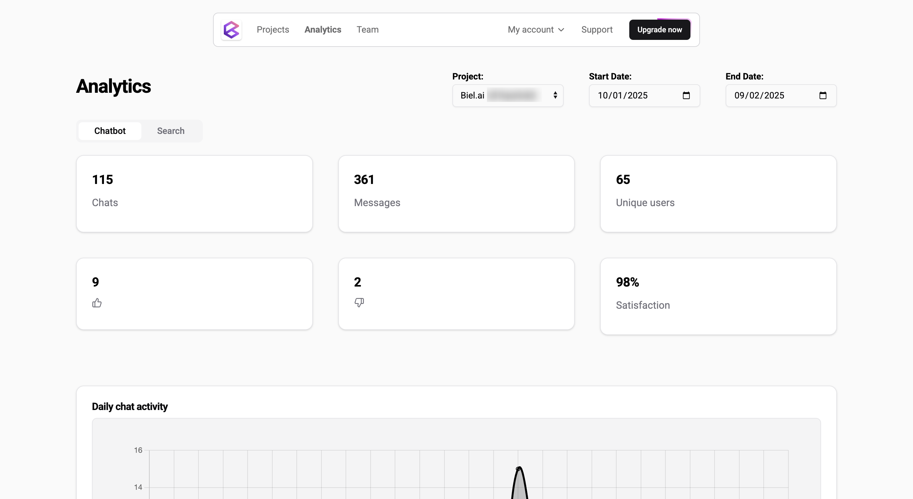

# View analytics

In the **Analytics** view, you can track project activity for a selected period. The analytics are organized into two tabs:

:::important
Only users with the **Administrator**, **Maintainer**, or **Editor** role can view analytics. For more details, see [Manage roles](roles.md).
:::

## Chatbot analytics

The **Chatbot** tab displays analytics related to chatbot conversations, including:

* **Chats:** Total number of chat sessions.
* **Messages:** Total number of messages exchanged.
* **Unique users:** Number of distinct users who interacted with the chatbot.
* **Satisfaction:** User satisfaction percentage.
* **Daily chat activity:** Graph showing chat activity over time.
* **Key pages driving conversations:** URLs where chatbot conversations originated, with occurrence counts.
* **Top countries driving conversations:** Geographic distribution showing which countries users are chatting from.
* **Frequently asked questions** *(Professional, Business, and Enterprise plans)***: ** Most common questions asked to your chatbot, grouped by semantic similarity. This data is analyzed daily.
* **Content gaps** *(Professional, Business, and Enterprise plans)***: ** Questions the chatbot couldn't answer, with AI-powered suggestions and tips on how to fix them. Analyzing content gaps consumes 10 interactions per analysis. This data is analyzed daily.

## Search analytics

The **Search** tab displays analytics related to search interactions, including:

* **Unique users:** Number of distinct users who performed searches.
* **Searches:** Total number of search queries.
* **Searches clicked:** Percentage of searches where users clicked on a result.
* **Daily search activity:** Graph showing search activity over time.
* **Top search terms:** Most frequently searched terms with occurrence counts.

## FAQ

### I cannot see FAQs or content gaps data

If you're not seeing data in the **Frequently asked questions** or **Content gaps** sections, this could be due to one of the following reasons:

* **You are not on a Professional, Business, or Enterprise plan.** These features are only available on paid plans. Upgrade your subscription to access them.
* **You recently upgraded.** After upgrading, please wait 24 hours for the data to appear. The analysis runs daily.
* **No historical data is processed.** Data tracking begins after you upgrade. Biel.ai does not process conversations that occurred before your subscription started.
* **No conversations to analyze.** There were no chatbot conversations or relevant questions to analyze from the previous day.
