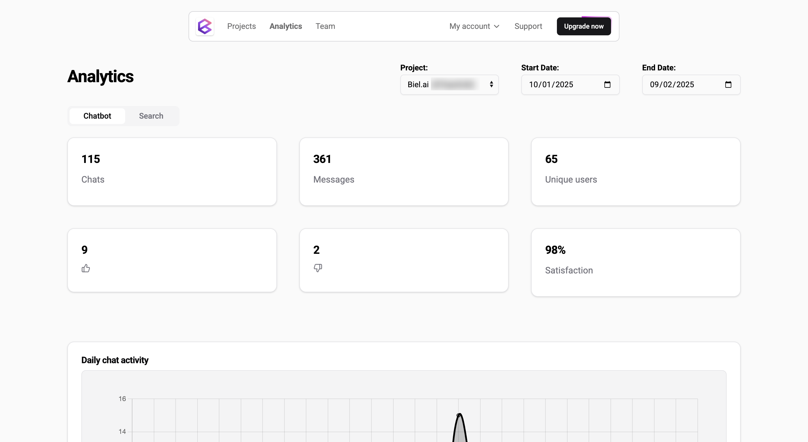

# View analytics

The **Analytics** view tracks project activity for a selected period, organized into two tabs:

:::important
Only **Administrator**, **Maintainer**, or **Editor** roles can view analytics. See [Manage roles](roles.md).
:::

## Chatbot analytics

* **Chats:** Total number of chat sessions.
* **Messages:** Total number of messages exchanged.
* **Unique users:** Number of distinct users who interacted with the chatbot.
* **Satisfaction:** User satisfaction percentage.
* **Daily chat activity:** Graph showing chat activity over time.
* **Key pages driving conversations:** URLs where chatbot conversations originated, with occurrence counts.
* **Top countries driving conversations:** Geographic distribution showing which countries users are chatting from.
* **Frequently asked questions** *(Professional, Business, and Enterprise plans)*: Most common questions asked to your chatbot, grouped by semantic similarity. Analyzed daily.
* **Content gaps** *(Professional, Business, and Enterprise plans)*: Questions the chatbot couldn't answer, with AI-powered suggestions on how to fix them. Consumes 10 interactions per analysis. Analyzed daily.

## Search analytics

* **Unique users:** Number of distinct users who performed searches.
* **Searches:** Total number of search queries.
* **Searches clicked:** Percentage of searches where users clicked on a result.
* **Daily search activity:** Graph showing search activity over time.
* **Top search terms:** Most frequently searched terms with occurrence counts.

## Troubleshooting

### FAQs or content gaps not showing

- **Plan requirement**: These features require a Professional, Business, or Enterprise plan.
- **Recently upgraded**: Wait 24 hours — the analysis runs daily.
- **No historical data**: Biel.ai only processes conversations that occur after your upgrade.
- **No conversations**: There were no chatbot conversations to analyze from the previous day.
