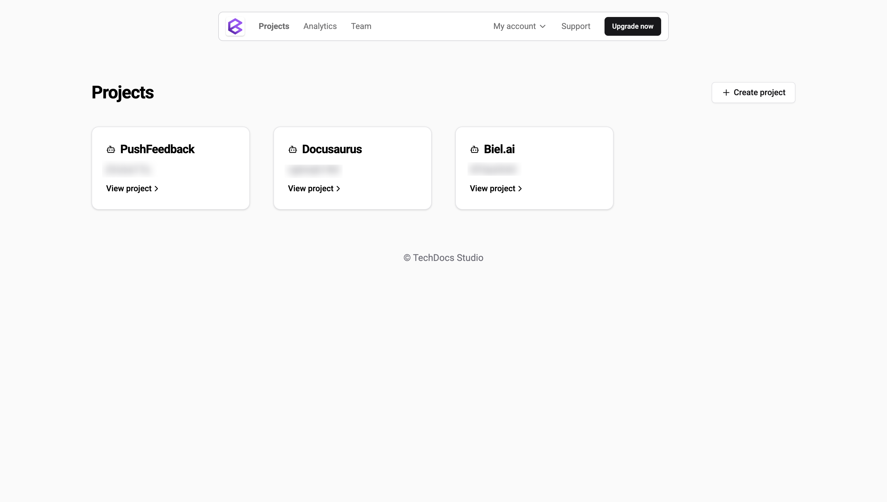
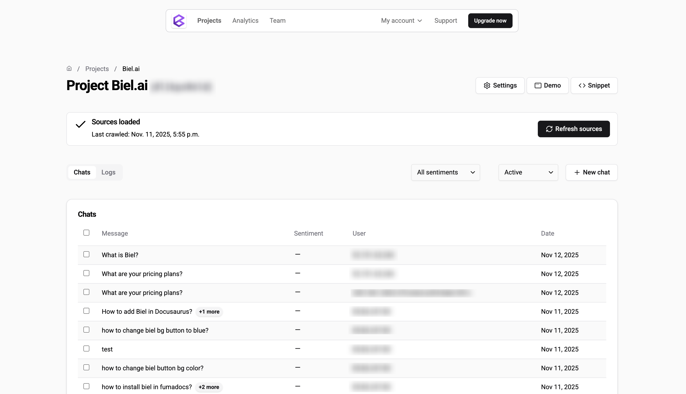
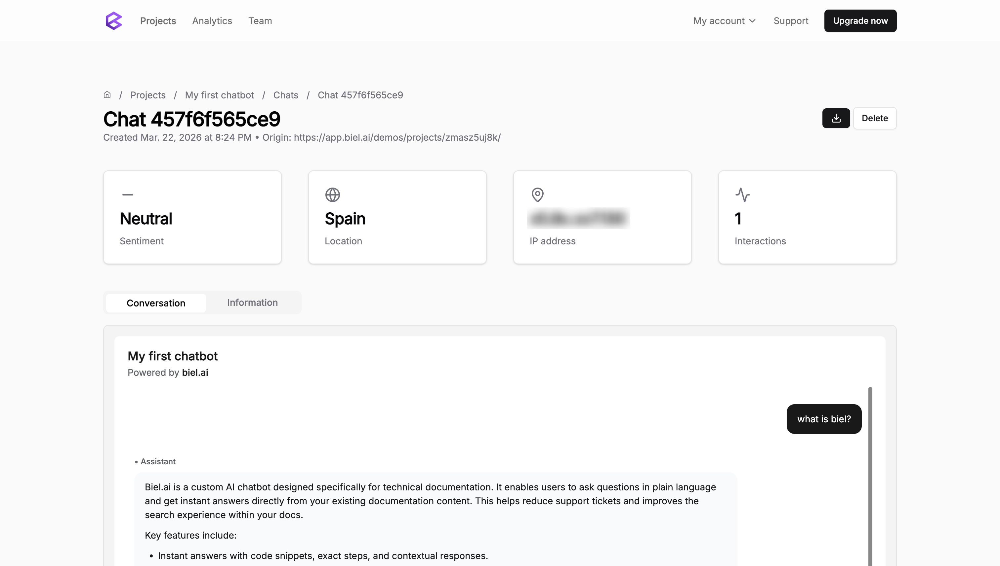
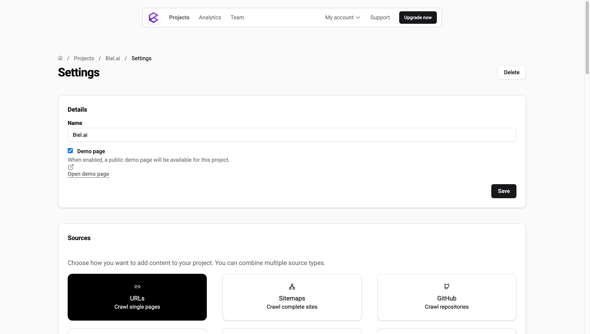

# Manage projects

Projects are the core organizational unit in Biel.ai where you configure your chatbot's behavior, data sources, and security settings.

## View all projects

The **Projects** dashboard displays a list of all your projects.

## Project detail page

From the **Projects** dashboard, click on a project name to open its detail page.

Here you can:

### Project information

- View the project ID
- Access the code snippet to embed the chatbot widget
- Access the project details using the **Settings** button

### Testing and monitoring

- Test your chatbot widget using the **New chat** button
- Recrawl sources to update indexed content
- View crawl logs to troubleshoot indexing issues
- Access detailed project analytics

### Chat management

- View all chat entries and conversation history
- Filter conversations by sentiment
- Click on any chat entry to view its details

### Project actions

- Delete the project

### Chat detail view

From the project detail page, click on any chat entry in the conversation list to view its full details.

This view shows detailed information about that specific conversation:

### User information

- Email address (if provided)
- Country and IP address
- Sentiment analysis of the conversation

### Conversation metadata

- URL where the chat originated
- Date and time of the conversation
- Full conversation history

### Actions

- **Download**: Export the chat in PDF, Excel, or CSV format
- **Delete**: Remove the chat entry

### Bulk actions

Select multiple chat entries using the checkboxes and access the **Select action** dropdown to perform bulk operations:

- **Archive chat entries**: Archive conversation history to keep your project organized while preserving data.
- **Export chat entries**: Download conversation data in bulk for analysis or record-keeping. Available formats include CSV, PDF, and Excel.
- **Delete chat entries**: Permanently remove selected conversations from your project.

## Project settings

From the project detail page, click the **Settings** button (located in the top right) to access the configuration options.

:::important
Only **Administrator** or **Maintainer** roles can manage project settings. See [Manage roles](roles.md).
:::

### Project details

Configure basic project information:

- **Name**: Change the project display name.
- **Demo page**: Enable or disable the demo page for testing your chatbot.

### Sources

Select and configure data sources for your project. Sources determine what information your chatbot can access to answer questions.

Available source types:
- **URLs**: Index specific web pages.
- **Sitemaps**: Index entire websites using XML sitemaps.
- **GitHub**: Index GitHub repositories directly.
- **Confluence**: Connect your Confluence workspace to index documentation.
- **OpenAPI files**: Import API specifications to provide accurate API documentation.
- **Files**: Upload documents (PDF, CSV, Excel, Word, TXT, MD).

For detailed configuration instructions, see [Sources](../customization/data-sources/overview.md).

### Restrictions

Control access to your chatbot:

- **Require authentication for all API access**: When enabled, all API access requires authentication. Available from **Business** plan. See [API authorization](/api).
- **Allowed domains**: Only domains from this list will be able to use your chatbot widget.

### UI settings

Customize the user interface and initial user experience:

- **Initial message**: Set a custom greeting. See [Initial message](../customization/initial-message.mdx).
- **Suggested questions**: Configure predefined questions to guide user interactions. See [Suggested questions](../customization/suggested-questions.mdx).

### Search filters

Configure filters that allow users to narrow search results by category in the search widget:

- **Title**: The label shown to users (for example, `API`, `Guides`, `Blog`).
- **Pattern**: A case-insensitive regular expression matched against result URLs. For example, `/tutorials/.*` matches all pages under `/tutorials`.

Filters appear in the search widget only when `hide-filters` is set to `false` on the widget and the user has started typing a query. For more details, see [Search filters](../customization/search-filters.md).

### LLM settings

Configure the AI model and behavior:

- **Select model**: Choose from GPT or Claude models based on your needs and subscription plan. See [Models](../customization/models.md).
- **Define prompt**: Extend the default AI Assistant or create a custom prompt for specialized behavior. See [Custom prompt](../customization/custom-prompt.md).
- **Enable think mode**: Activate deeper AI reasoning for complex questions. See [Reasoning modes](../customization/reasoning-modes.md).

### Data privacy

Enhance user privacy and comply with regulations:

- **Remove PII**: Automatically detect and remove personally identifiable information (names, emails, phone numbers) from conversations.
- **Disable IP collection**: Stop collecting IP addresses to enhance privacy (affects some analytics features).

For comprehensive privacy configuration, see [Data privacy](../customization/data-privacy.mdx).

### MCP settings

Configure Model Context Protocol integration to connect AI coding assistants to your project:

- **Enable MCP server**: Allow access to this project through the Model Context Protocol.
- **MCP server name**: Set a custom name for the MCP server.
- **Metadata tag**: Define a tag to identify conversations originating from MCP.

For setup instructions, see [MCP server](../integrations/mcp-server.mdx).
