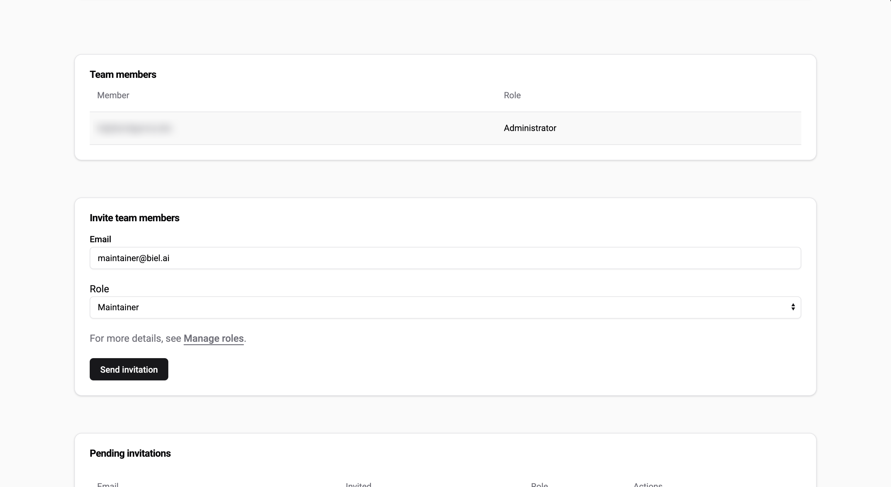

# Manage roles

From the **Team** view, you can assign and manage roles and permissions for your team members.

:::important  
Only users with the **Administrator** or **Maintainer** role can manage roles. For more details, see [Manage roles](roles.md).  
:::

## Available roles  

There are four predefined roles, each with different levels of access and permissions.  

### Administrator

Manages the Biel.ai integration and team members.  

* Has full access to all platform actions.  

### Maintainer  

Handles Biel.ai configuration and billing settings.  

* Can perform all actions except deleting admin accounts.  

### Editor  

Focuses on reviewing chat interactions and analytics.  

* Can view all chat interactions.  
* Can access analytics.  
* Can delete chats.  
* Cannot create new projects.
* Cannot edit project or team settings.  

### Viewer  

For users who only need access to their own chat interactions.  

* Can view only their own chat interactions.  
* Cannot access analytics.  
* Cannot edit project or team settings. 
* Cannot create new projects.
* Cannot delete chats.  

## Assign a role when inviting a team member

When inviting a new team member from the **Team** view under the **Invite team members** section, select their role in the invitation form. The assigned permissions will take effect once they accept the invitation.

## Change a team member's role  

To update a team member’s role:  

1. Log in to your Biel.ai account and navigate to your dashboard.
2. Select your project from the list of available projects.
3. In the dashboard, click **Team** in the top navigation bar.
4. Locate the team member in the **Team members** list.  
5. Click on their email address.  
6. Select the new role from the dropdown and click **Update role**.  
7. The changes will be applied immediately.  
