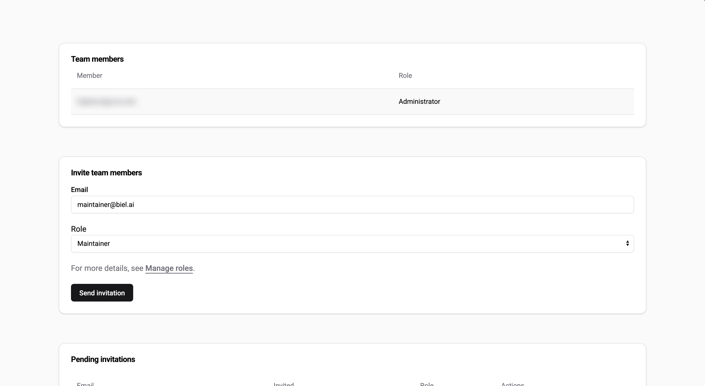

# Manage roles

## Available roles

| Role | Access level |
|------|-------------|
| **Administrator** | Full access to all platform actions. |
| **Maintainer** | All actions except deleting admin accounts. |
| **Editor** | View all chats, access analytics, delete chats. Cannot create projects or edit settings. |
| **Viewer** | View own chats only. No analytics, settings, or project creation. |

## Assign a role when inviting a team member

When inviting a team member from **Team > Invite team members**, select their role. Permissions take effect after they accept.

## Change a team member's role

To update a team member's role:

1. In the [Biel.ai dashboard](https://app.biel.ai), click **Team** in the top navigation bar.
2. Locate the team member in the **Team members** list.
3. Click on their email address.
4. Select the new role from the dropdown and click **Update role**.
