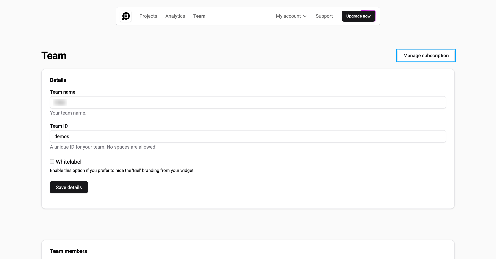

# Manage subscription

:::important
Only **Administrator** or **Maintainer** roles can manage subscriptions. See [Manage roles](roles.md).
:::

From **Team > Manage subscription**, you can:

* Upgrade your subscription.
* Cancel your subscription.
* View your invoices.
* Change your billing details.
* View your plan usage.
* Buy more seats.
* Buy more interactions.
