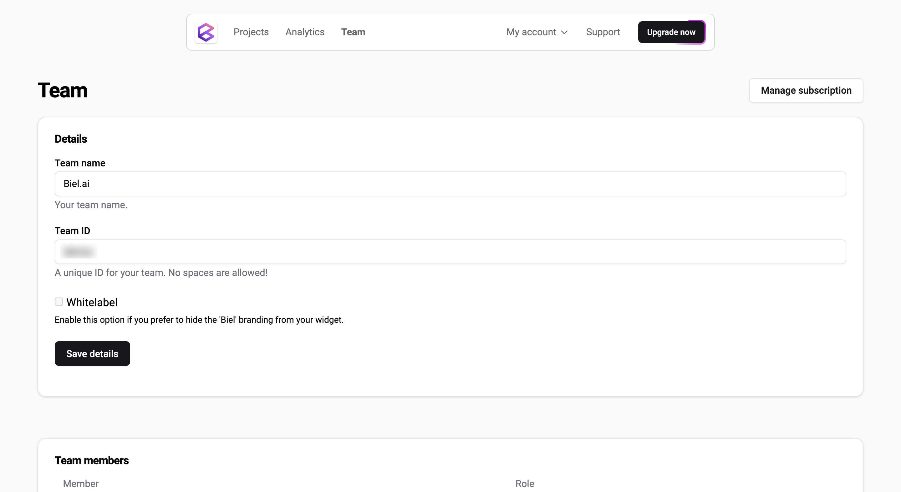

# Manage team

* Change the team name.
* Enable or disable the Biel.ai logo (whitelabel).
* Invite new members.
* Remove members.
* Manage member roles and permissions.
* Manage your subscription.
* Delete your team.

:::important
Only **Administrator** or **Maintainer** roles can manage teams. See [Manage roles](roles.md).
:::
