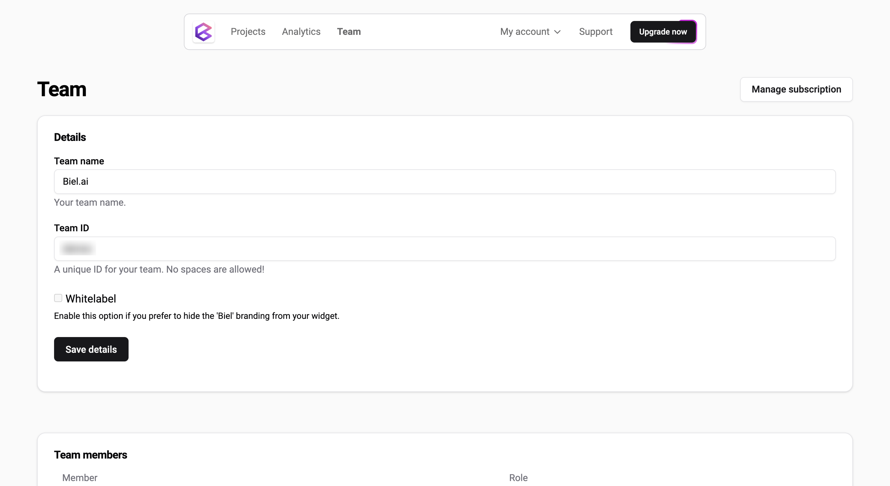

# Manage team

From the **Team** view, you can:  

* Change the team name.  
* Enable or disable the Biel.ai logo (whitelabel).  
* Invite new members.
* Remove members.  
* Manage member roles and permissions.  
* Manage your subscription.  
* Delete your team.  

:::important  
Only users with the **Administrator** or **Maintainer** role can manage teams. For more details, see [Manage roles](roles.md).  
:::  
