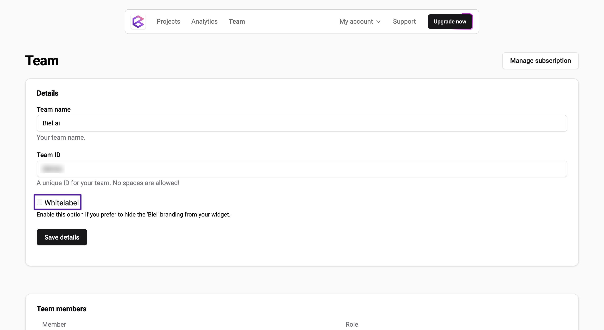

# Whitelabel

Biel.ai offers a white labeling option which allows you to hide the "Powered by Biel.ai" text, link, and logo from the chatbot widget. This feature is useful when you want to maintain a consistent brand experience on your website without any third-party branding.

:::important
This feature is available on the **Professional** plan and above.
:::

## Remove Biel.ai branding

:::important
Only users with the **Administrator** or **Maintainer** role can enable this feature. For more details, see [Manage roles](roles.md).
:::

To remove the Biel.ai logo from the widget, follow these steps:

1. Open [app.biel.ai](https://app.biel.ai).

2. Log in using your account credentials.

3. Once on the dashboard, click **Team** in the top navigation bar.

4. Locate the **Whitelabel** option and activate it to enable white labeling.

    

5. Click the **Save**.

6. To confirm the changes, go to any webpage where you've implemented the Biel.ai widget. The Biel.ai logo should no longer appear.  
