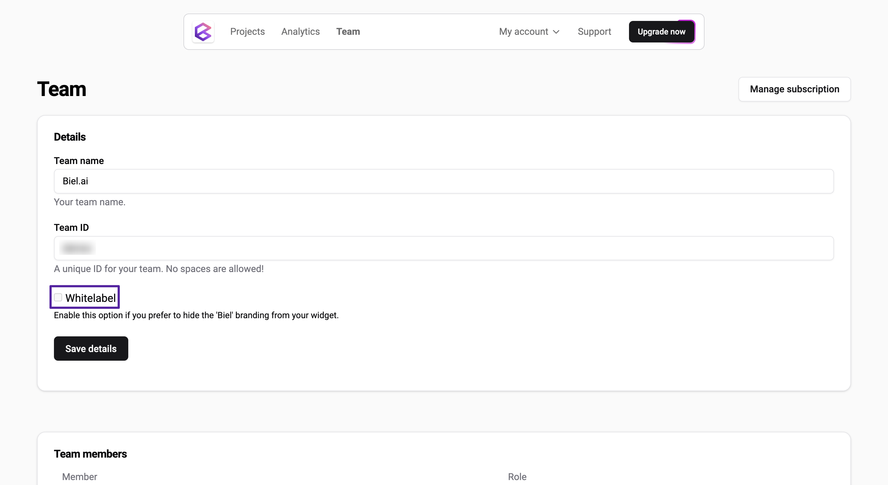

# Whitelabel

White labeling lets you hide the "Powered by Biel.ai" text, link, and logo from the chatbot widget to maintain a consistent brand experience.

:::important
This feature is available on the **Professional** plan and above. Only **Administrator** or **Maintainer** roles can manage white labeling. See [Manage roles](roles.md).
:::

## Remove Biel.ai branding

1. In [app.biel.ai](https://app.biel.ai), go to **Team** in the top navigation bar.

2. Locate the **Whitelabel** option and activate it.

    

3. Click **Save**.

To confirm, open any page where you've embedded the Biel.ai widget. The Biel.ai logo should no longer appear.
