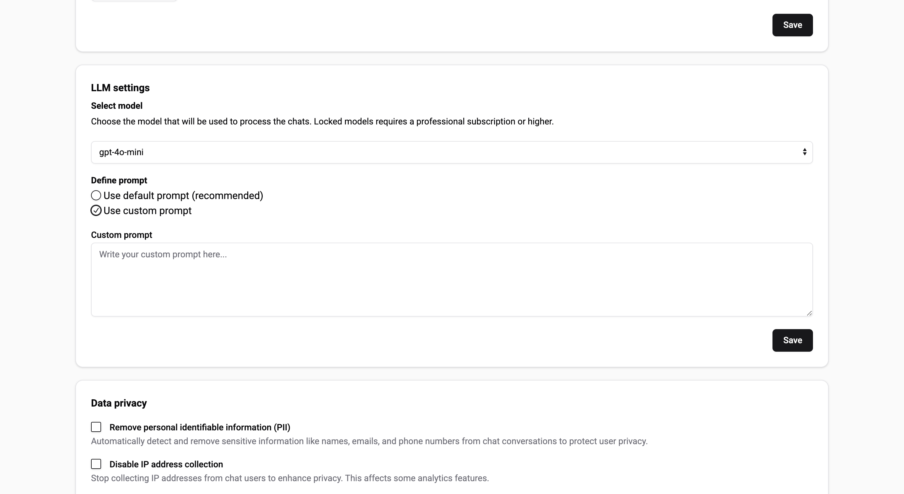

# Custom prompt

:::warning  
Defining your own custom prompt gives you full control over the chatbot's behavior, but it may disable some of the platform's built-in safeguards and advanced processing features.
:::

A prompt is the instruction or set of instructions given to the chatbot that guides how it processes and responds to user input.

By default, Biel.ai uses a well-optimized prompt designed for technical documentation and support interactions.

If you want the chatbot to behave differently (e.g., for other use cases), the platform is flexible and allows you to define your own custom prompt.

### Customize the prompt  

:::important  
Only users with the **Administrator** or **Maintainer** role can manage projects. For more details, see [Manage roles](../customization/roles.md).  
:::  

Follow these steps to change the prompt:

1. Log in to your Biel.ai account and navigate to your dashboard.
2. Select your project from the list of available projects.
3. Click **Settings**.
4. Under the **LLM settings > Define prompt** section, select **User custom prompt**:

    

5. Define your custom prompt. Example:

    ```
    You are a customer support assistant for [Product Name]. Provide clear, accurate answers related to product features, troubleshooting, and usage. Keep responses professional and focused on the product. Only respond based on the information you can extract from CONTEXT and the conversation HISTORY.
    ```

6. Click **Save** to apply the changes.
