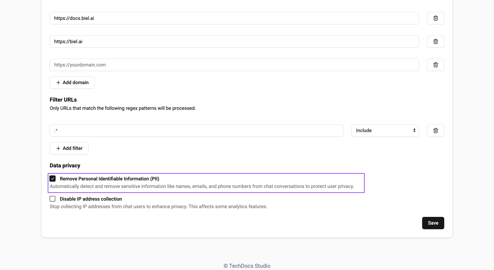
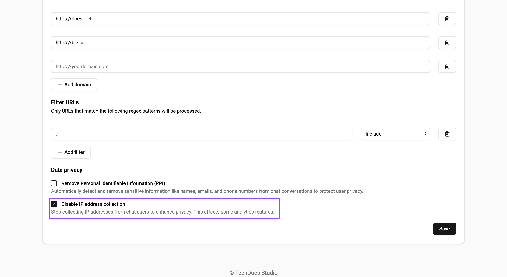
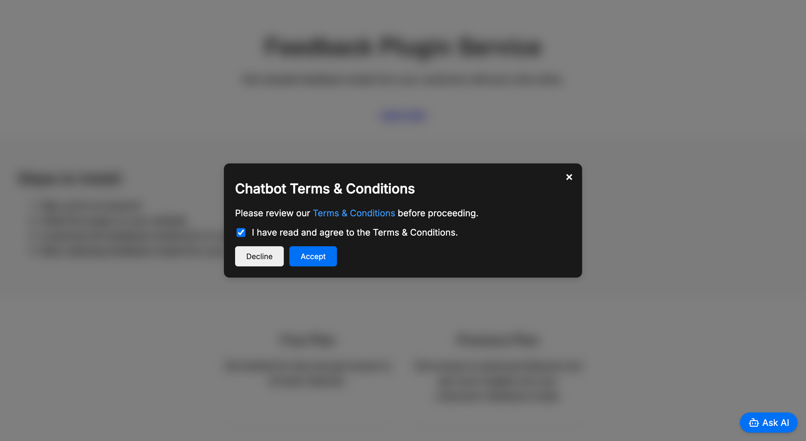

# Data privacy

On this page, you will learn how to manage data privacy settings in Biel.ai to enhance user security and comply with privacy regulations such as GDPR and CCPA.

## Remove personal identifiable information

You can configure Biel.ai to automatically detect and remove sensitive information, such as names, emails, and phone numbers, from chat conversations to protect user privacy.

Once a user enters personally identifiable information (PII), it will not be stored on our servers. Instead, it will be replaced with a placeholder (e.g., `[REDACTED-email]`, `[REDACTED-name]`).

To enable PII removal, follow these steps:

1. Open [app.biel.ai](https://app.biel.ai).
2. Log in with your account credentials.
3. In the dashboard, click **Projects** in the top navigation bar.
4. Find and select your project from the list.
5. Click **Settings**.
6. In the **Data privacy** section, enable **Remove Personally Identifiable Information (PII)**:

    

7. Future conversations will automatically redact PII.

## Disable IP address collection

You can choose not to collect user IP addresses. However, disabling this feature will affect certain analytics capabilities, including:

- Detecting the user's country.
- Counting unique users accurately.

To disable IP address collection:

1. Open [app.biel.ai](https://app.biel.ai).
2. Log in with your account credentials.
3. In the dashboard, click **Projects** in the top navigation bar.
4. Find and select your project from the list.
5. Click **Settings**.
6. In the **Data privacy** section, enable **Stop collecting IPs**:

    

## Require to accept Terms & Conditions before opening the chat

You can configure the chat widget to require users to accept Terms & Conditions before they can start a conversation.



To enable this requirement, configure the widget as follows:

```html
<biel-button 
    show-terms-modal="true" 
    terms-title="Chatbot Terms & Conditions" 
    terms-description="Please review our <a href='https://biel.ai/terms' target='_blank' rel='noopener'>Terms & Conditions</a> before proceeding." 
    terms-checkbox-text="I have read and agree to the Terms & Conditions." 
    project="<PROJECT_ID>"> Ask AI
</biel-button>
```

Replace `<PROJECT_ID>` with your actual project ID. If needed, update the `terms-description` link to direct users to your specific Terms & Conditions or privacy policy.

