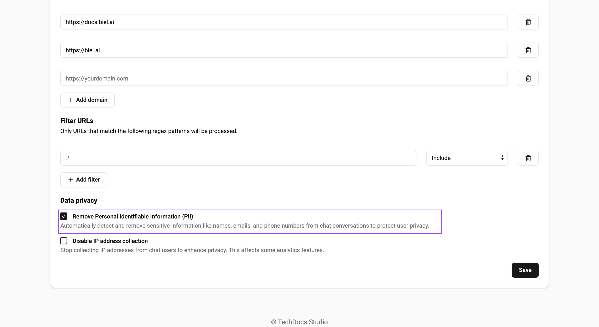
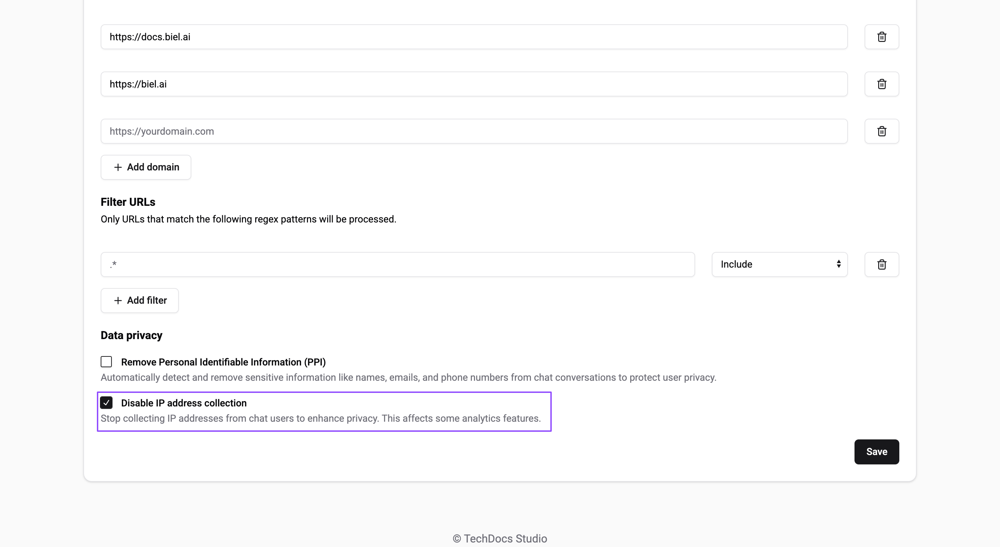
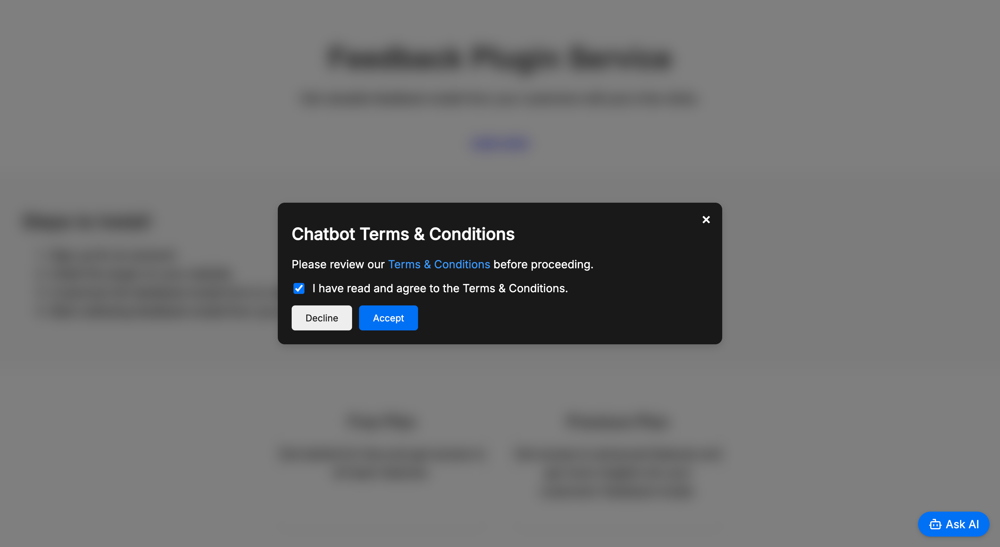

# Data privacy

Configure data privacy settings to comply with regulations like GDPR and CCPA.

:::important
Only **Administrator** or **Maintainer** roles can manage projects. See [Manage roles](../administration/roles.md).
:::

## Remove personally identifiable information

Biel.ai can automatically detect and redact PII (names, emails, phone numbers) from chat conversations. Redacted data is replaced with placeholders (e.g., `[REDACTED-email]`, `[REDACTED-name]`) and never stored on Biel.ai servers.

1. In the [Biel.ai dashboard](https://app.biel.ai), select your project.
2. Click **Settings**.
3. Under **Data privacy**, enable **Remove Personally Identifiable Information (PII)**.

    

Future conversations automatically redact PII.

## Disable IP address collection

Stop collecting user IP addresses. This disables country detection and unique user counts in analytics.

1. In the [Biel.ai dashboard](https://app.biel.ai), select your project.
2. Click **Settings**.
3. Under **Data privacy**, enable **Stop collecting IPs**.

    

## Require Terms & Conditions acceptance

Require users to accept Terms & Conditions before starting a conversation.



Add these attributes to your `<biel-button>`:

```html
<biel-button
    show-terms-modal="true"
    terms-title="Chatbot Terms & Conditions"
    terms-description="Please review our <a href='https://biel.ai/terms' target='_blank' rel='noopener'>Terms & Conditions</a> before proceeding."
    terms-checkbox-text="I have read and agree to the Terms & Conditions."
    project="<PROJECT_ID>">
        Ask AI
</biel-button>
```

Replace `<PROJECT_ID>` with your project ID. Update the `terms-description` link to point to your own Terms & Conditions.

