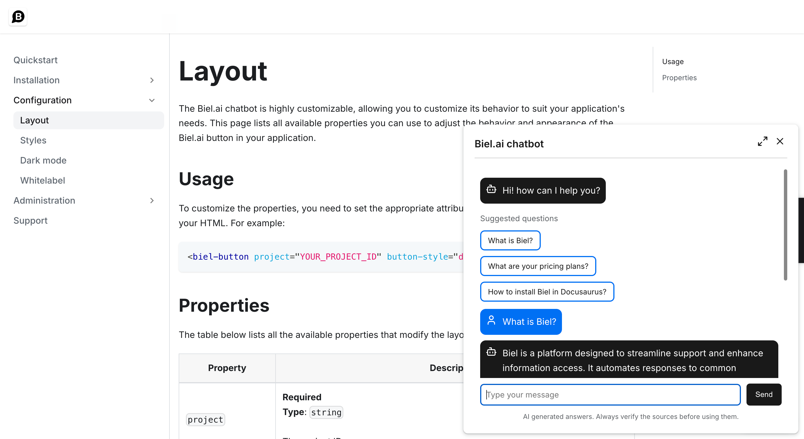
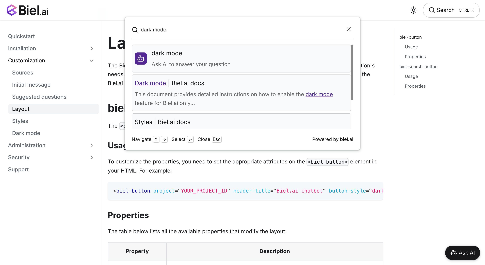

# Widget customization

The Biel.ai widget is highly customizable, allowing you to adjust its behavior and appearance to suit your application's needs. This includes options to modify the button's text to align with your company's tone or support multiple languages (i18n). 

This page lists all available properties you can use to configure the Biel.ai widget and ensure it fits within your application.

## biel-button

The `<biel-button>` widget enables a conversational chat powered by AI in your site.



### Usage

To customize the properties, you need to set the appropriate attributes on the `<biel-button>` element in your HTML. For example:

```html
<biel-button project="YOUR_PROJECT_ID" header-title="Biel.ai chatbot" button-style="dark">Ask AI</biel-button>
```

### Chatbot button properties

The table below lists all the available properties that modify the button:

| Property               | Description                                                                                   |
|------------------------|-----------------------------------------------------------------------------------------------|
| **Layout**             |  |  |
| `project`              | **Required**<br />**Type**: `string`<br /><br />The project ID.                                |
| `button-position`      | **Type**: `string`<br />**Default value**: `default`<br />**Available values:** `default`, `bottom-right`, `bottom-left`, `center-right`, `center-left`, `custom` <br /><br />Controls the position of the chat button on your webpage. Use `custom` to position the button using CSS.|
| `button-style`         | **Type**: `string`<br />**Default value**: `default`<br />**Available values:** `default`, `dark`, `light`<br /><br />Defines the visual style of the chat button. `dark` uses a dark theme, `light` uses a light theme, and `default` follows your site's theme.|
| `custom-font`          | **Type**: `boolean`<br />**Default value**: `false`<br /><br />When set to `true`, disables loading of the Inter font. Use this if your site already uses a different font to improve load time and maintain font consistency.|
| `hide-icon`            | **Type**: `boolean`<br />**Default value**: `false`<br /><br />When set to `true`, the button icon hides. |
| `ai-icon`              | **Type**: `string`<br />**Default value**: `bot`<br />**Available values:** Various AI icon types<br /><br />Specifies which AI icon to display in the button.|
| `hide-avatars`         | **Type**: `boolean`<br />**Default value**: `false`<br /><br />When set to `true`, hides avatars in the chat interface.|
| `api-key`              | **Type**: `string`<br />**Default value**: ``<br /><br />API key for authenticating requests to private projects. Required for private projects with `create_chat` and `project_read` permissions. Not required for public projects.|

### Chatbot modal properties

The table below lists all the available properties that modify the chatbot modal:

| Property               | Description                                                                                   |
|------------------------|-----------------------------------------------------------------------------------------------|
| **Layout**             |  |  |
| `disable-input`        | **Type**: `boolean`<br />**Default value**: `false`<br /><br />When set to `true`, the user input field is disabled. |
| `email`                | **Type**: `string`<br />**Default value**: ``<br /> An email address or ID for conversation tracking. This ID will be associated with the chat session in your project dashboard for analytics and user tracking purposes. |
| `expand-modal`         | **Type**: `boolean`<br />**Default value**: `false`<br /><br />When set to `true`, the chat modal opens in its expanded state by default. |
| `hide-close-button`    | **Type**: `boolean`<br />**Default value**: `false`<br /><br />When set to `true`, the close icon hides. |
| `hide-expand-button`   | **Type**: `boolean`<br />**Default value**: `false`<br /><br />When set to `true`, the expand button icon hides. |
| `hide-refresh-button`  | **Type**: `boolean`<br />**Default value**: `false`<br /><br />When set to `true`, the refresh button hides. |
| `hide-feedback`        | **Type**: `boolean`<br />**Default value**: `false`<br /><br />When set to `true`, removes the feedback options (like thumbs up/down) that users can use to rate AI responses. |
| `hide-sources`         | **Type**: `boolean`<br />**Default value**: `false`<br /><br />When set to `true`, hides the sources section from AI responses in the chat interface. |
| `hide-think-mode-button` | **Type**: `boolean`<br />**Default value**: `false`<br /><br />When set to `true`, hides the Think Mode button from the chatbot header. Only visible if your project has the reasoning mode plugin enabled. |
| `hide-tooltips`        | **Type**: `boolean`<br />**Default value**: `false`<br /><br />When set to `true`, hides the tooltips that appear when hovering over header icons. |
| `modal-position`       | **Type**: `string`<br />**Default value**: `center`<br />**Available values:** `center`, `top-center`, `bottom-right`, `bottom-left`<br /><br />Determines where the chat modal appears on the screen when opened. Choose the position that best fits your website's layout.|
| `show-terms-modal` | **Type**: `boolean`<br />**Default value**: `false`<br /><br />When set to `true`, displays a terms and conditions modal before starting the chat. |
| `think-mode-enabled`   | **Type**: `boolean`<br />**Default value**: `false`<br /><br />When set to `true`, enables Think Mode by default for deeper AI reasoning. Requires the reasoning mode plugin to be enabled for your project. See [Think Mode](/docs/customization/think-mode) for details. |
| **Text**             |  |  |
| `assistant-label`      | **Type**: `string`<br />**Default value**: `Assistant`<br /><br />Label text displayed above AI responses in the chat. |
| `close-button-text`    | **Type**: `string`<br />**Default value**: `Close`<br /><br />Tooltip text for the close button in the chatbot header. |
| `collapse-button-text` | **Type**: `string`<br />**Default value**: `Collapse`<br /><br />Tooltip text for the collapse button in the chatbot header. |
| `error-message-4-0-3`  | **Type**: `string`<br />**Default value**: `Oops! The request URL or API key is invalid or not authorized for this project.`<br /><br />403 unauthorized message.    |
| `error-message-4-0-4`  | **Type**: `string`<br />**Default value**: `Oops! We could not find the provided project ID.`<br /><br />404 not found message.    |
| `error-message-default`| **Type**: `string`<br />**Default value**: `Oops! Please try again later.`<br /><br />500 error message. |
| `expand-button-text`   | **Type**: `string`<br />**Default value**: `Expand`<br /><br />Tooltip text for the expand button in the chatbot header. |
| `footer-text`          | **Type**: `string`<br />**Default value**: `AI-generated answers may contain errors. Verify official sources before use.`<br /><br />Footer text. |
| `header-title`         | **Type**: `string`<br />**Default value**: `Company Name AI`<br /><br />Title text for the chatbot header. |
| `input-placeholder-text` | **Type**: `string`<br />**Default value**: `Type your message`<br /><br />Placeholder text displayed in the chatbot's input field. |
| `refresh-button-text`  | **Type**: `string`<br />**Default value**: `Refresh`<br /><br />Tooltip text for the refresh button in the chatbot header. |
| `send-button-text`       | **Type**: `string`<br />**Default value**: `Send`<br /><br />Text displayed on the send button next to the input field. |
| `sources-text`           | **Type**: `string`<br />**Default value**: `Sources`<br /><br />Text displayed for introducing sources in messages. |
| `suggested-questions`    | **Type**: `array`<br />**Default value**: `[]`<br /><br />An array of strings containing questions that will be shown to users when they open the chat. These questions help guide users on what they can ask the AI. |
| `suggested-questions-title` | **Type**: `string`<br />**Default value**: `Suggested questions`<br /><br />The heading text that appears above the list of suggested questions in the chat interface. |
| `terms-checkbox-text`    | **Type**: `string`<br />**Default value**: `I have read and agree to the Terms & Conditions.`<br /><br />Text displayed next to the terms acceptance checkbox. |
| `terms-description`      | **Type**: `string`<br />**Default value**: `Please review our <a href='https://biel.ai/terms' target='_blank' rel='noopener'>Terms & Conditions</a> before proceeding.`<br /><br />Description text shown in the terms and conditions modal. |
| `terms-title`            | **Type**: `string`<br />**Default value**: `Chatbot Terms & Conditions`<br /><br />Title text for the terms and conditions modal. |
| `think-mode-button-text` | **Type**: `string`<br />**Default value**: `Enable deeper reasoning (takes more time)`<br /><br />Tooltip text for the Think Mode button in the chatbot header. |
| `welcome-message`        | **Type**: `string`<br />**Default value**: ""<br /><br />A custom greeting message that appears when users first open the chat. Use this to set the tone and provide initial guidance for the conversation. |

## biel-search-button

The `<biel-search-button>` widget offers a search-based interaction that allows users to query documentation or other indexed content.



### Usage

To customize the properties, you need to set the appropriate attributes on the `<biel-search-button>` element in your HTML. For example:

```html
<biel-search-button project="YOUR_PROJECT_ID" button-style="rounded" search-placeholder="Search here...">Search</biel-search-button>
```

### Search button properties

The table below lists all the available properties that modify the layout:

| Property               | Description                                                                                   |
|------------------------|-----------------------------------------------------------------------------------------------|
| **Layout**             |  |  |
| `project`              | **Required**<br />**Type**: `string`<br /><br />The project ID.                                |
| `button-style`         | **Type**: `string`<br />**Default value**: `default`<br />**Available values:** `default`, `rounded`<br /><br />Style of the button.|
| `custom-font`          | **Type**: `boolean`<br />**Default value**: `false`<br /><br />When set to `true`, the [Inter font](https://fonts.google.com/specimen/Inter) will not be loaded. Useful if your site already uses a different font, enabling a quicker load time.|
| `hide-ctrl-k`          | **Type**: `boolean`<br />**Default value**: `false`<br /><br />When set to `true`, the Ctrl+K text hides. |
| `hide-icon`            | **Type**: `boolean`<br />**Default value**: `false`<br /><br />When set to `true`, the button icon hides. |
| `ai-icon`              | **Type**: `string`<br />**Default value**: `bot`<br />**Available values:** Various AI icon types<br /><br />Specifies which AI icon to display in the search button.|
| `hide-avatars`         | **Type**: `boolean`<br />**Default value**: `false`<br /><br />When set to `true`, hides avatars in the chat interface.|
| `api-key`              | **Type**: `string`<br />**Default value**: ``<br /><br />API key for authenticating requests to private projects. Required for private projects with `create_chat`, `project_search`, and `project_read` permissions. Not required for public projects.|

### Search modal properties

The table below lists all the available properties that modify the search modal:

| Property               | Description                                                                                   |
|------------------------|-----------------------------------------------------------------------------------------------|
| **Layout**             |  |  |
| `hide-ask-ai-button`   | **Type**: `boolean`<br />**Default value**: `false`<br /><br />When set to `true`, the "Ask AI" button is hidden from the search results. |
| `hide-descriptions`    | **Type**: `boolean`<br />**Default value**: `false`<br /><br />When set to `true`, hides descriptions in search results for a cleaner interface.|
| `hide-filters`         | **Type**: `boolean`<br />**Default value**: `true`<br /><br />When set to `true`, removes the source filter dropdown from the search modal, simplifying the search interface. |
| `hide-navigation-buttons` | **Type**: `boolean`<br />**Default value**: `false`<br /><br />When set to `true`, hides navigation buttons (up and down arrows, enter, escape) in the search modal for a simplified interface. |
| `modal-position`       | **Type**: `string`<br />**Default value**: `top-center`<br />**Available values:** `center`, `top-center`, `top-right`, `bottom-left`<br /><br />Position of the modal.|
| `stacked`              | **Type**: `boolean`<br />**Default value**: `false`<br /><br />When set to `true`, displays search results in a stacked layout.|
| `clean-titles`         | **Type**: `boolean`<br />**Default value**: `false`<br /><br />When set to `true`, removes site names from page titles that follow the format "Page Title | Site Name" for cleaner presentation.|
| **Text**             |  |  |
| `ai-result-fragment`   | **Type**: `string`<br />**Default value**: `"Ask AI to answer your question"`<br /><br />Text displayed in the AI result section of the search modal. |
| `search-placeholder`   | **Type**: `string`<br />**Default value**: `"Search or ask AI..."`<br /><br />Placeholder for the search input. |


### Search chatbot modal properties

Most properties that can be defined in `<biel-button>` for configuring the chatbot modal can be set in the `biel-search-button`.

For details, see [Chatbot modal properties](#chatbot-modal-properties).