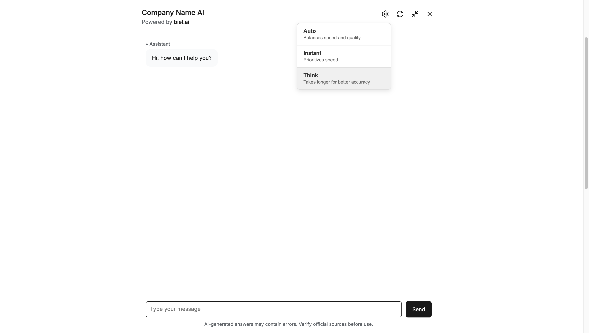
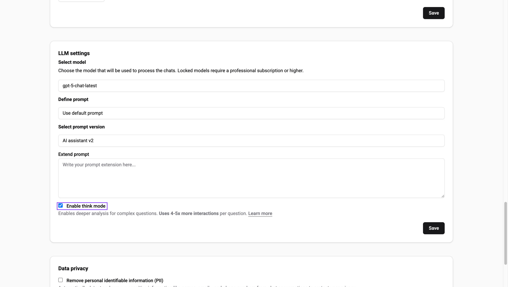

# Reasoning modes

Control how the chatbot reasons through questions with three modes: Auto, Instant, and Think.



## Available modes

| Mode | Description | Interactions per question |
|------|-------------|--------------------------|
| **Auto** (default) | Balances speed and quality. The system determines the appropriate reasoning depth. | 1 |
| **Instant** | Fast answers for simple questions and quick lookups. | 1 |
| **Think** | Deep reasoning for complex technical questions. Takes longer but more accurate. | 4-8 |

## Enable reasoning modes

:::important
Only **Administrator** or **Maintainer** roles can manage projects. See [Manage roles](../administration/roles.md).
:::

1. In the [Biel.ai dashboard](https://app.biel.ai), select your project.
2. Click **Settings**.
3. Under **LLM Settings**, check **Enable think mode**.
4. Click **Save**.



Once enabled, users can select their preferred mode from the settings icon in the chat widget header. The selection persists across page reloads.

## Widget attributes

Control reasoning mode behavior with these `<biel-button>` attributes:

| Attribute | Default | Description |
|-----------|---------|-------------|
| `think-mode-enabled` | `false` | Set Think mode as the default instead of Auto. |
| `hide-settings-button` | `false` | Hide the settings button so users can't change the mode. |

**Set Think mode as default:**

```html
<biel-button
  project="my-project"
  think-mode-enabled="true"
>Ask AI</biel-button>
```

:::tip[Force Think mode for all questions]
Combine both attributes to always use Think mode without letting users change it. This increases interaction usage by 4-8x per question.

```html
<biel-button
  project="my-project"
  think-mode-enabled="true"
  hide-settings-button="true"
>Ask AI</biel-button>
```
:::


