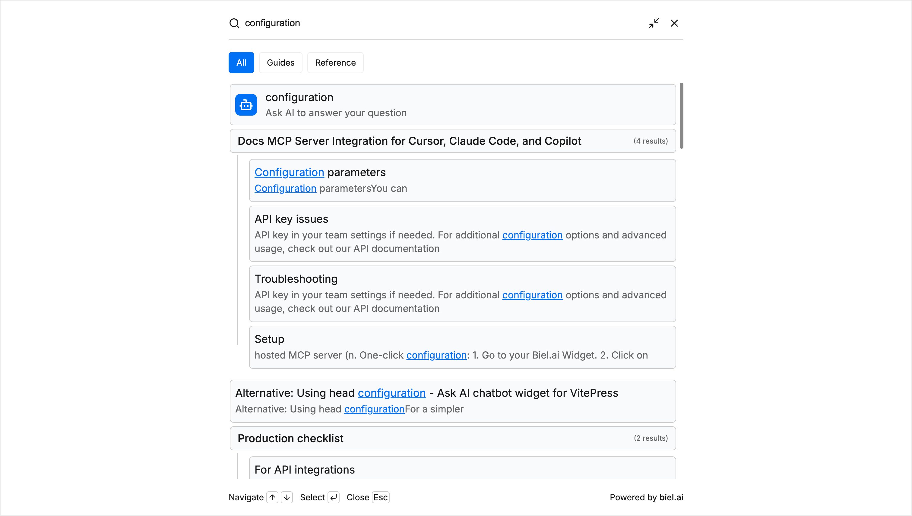

# Search filters

Search filters let users narrow search results by category. Each filter maps a label to a URL pattern — when selected, only matching results appear.



## Configure filters

:::important
Only **Administrator** or **Maintainer** roles can manage projects. See [Manage roles](../administration/roles.md).
:::

1. In the [Biel.ai dashboard](https://app.biel.ai), select your project.
2. Go to **Settings** > **Search filters**.
3. Add one or more filters. Each filter requires:
   - **Title:** The label shown in the widget (for example, `API`, `Guides`, `Blog`).
   - **Pattern:** A case-insensitive regular expression matched against result URLs. Use `\.` to match a literal dot and `.*` to match any characters. See [Pattern examples](#pattern-examples) for common use cases.
5. Click **Save**.

### Pattern examples

| Goal                       | Pattern               | Matches                                                                              |
| -------------------------- | --------------------- | ------------------------------------------------------------------------------------ |
| Pages under a path         | `/docs/api/.*`        | `https://example.com/docs/api/overview`, `https://example.com/docs/api/auth/tokens`  |
| A specific subdomain       | `docs\.example\.com`  | `https://docs.example.com/guide`, `https://docs.example.com/api/v2`                  |
| Any subdomain              | `.*\.example\.com`    | `https://docs.example.com/guide`, `https://blog.example.com/post`                    |
| URLs containing a keyword  | `release-notes`       | `https://example.com/release-notes/v2`, `https://example.com/docs/release-notes`     |

## Enable filters in the widget

By default, the search widget hides filters. To show them, set `hide-filters` to `false`:

```html
<biel-search-button
  project="YOUR_PROJECT_ID"
  hide-filters="false"
>Search</biel-search-button>
```

## Customize filter appearance

To style filter buttons, use CSS custom properties. For details, see [Styles](./styles.mdx).

## Limitations

- Filters are only available for the search widget (`<biel-search-button>`), not the chat widget (`<biel-button>`).
- Each filter title must be unique within a project.
- Filters do not affect the relevance ranking of results.
