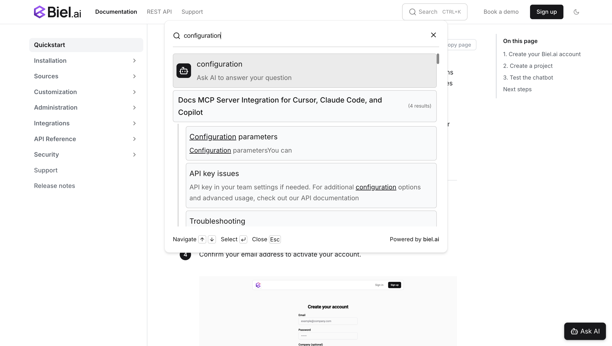

# Search

The search widget uses semantic search to find relevant content across your indexed sources.



## How search works

Results are ranked by similarity to the query (score between 0 and 1), based on:

- Page content and title
- Meta keywords and description
- URL structure

You can adjust rankings with a [boost score](#boost-search-results): positive values (e.g., `0.5`) increase a page's ranking, negative values (e.g., `-0.5`) decrease it. The final score is the base score plus the boost.

:::tip
Any page with a final score above 0 can appear in results. Use a negative boost (e.g., `-1.0`) to effectively hide a page from search.
:::

## Installation

- [CDN installation guide](../installation/cdn.md#add-the-search-widget)
- [Platform-specific guides](../installation.md)

## Customization

### Widget appearance

See [Layout](../customization/layout.mdx#biel-search-button) for styling and positioning options.

### Search filters

You can configure filters that let users narrow search results by category (for example, API, Guides, Blog). For details, see [Search filters](../customization/search-filters.md).

### Metadata and keywords

Add meta tags to improve how your content is indexed and ranked:

```html
<meta name="description" content="Learn how to configure and customize your Biel.ai chatbot">
<meta name="keywords" content="chatbot, configuration, customization, Biel.ai, setup">
```

For Docusaurus, Sphinx, and other documentation systems, see [Metadata by platform](#metadata-by-platform).

### Boost search results

Use boost scores to prioritize certain pages. For example, boost guides by `0.5` so they rank higher, while leaving reference pages at `0` for natural ranking.

Add the following meta tag to the `<head>` of the page:

```html
<meta name="biel:boost_score" content="0.5">
```

For Docusaurus, Sphinx, and other documentation systems, see [Metadata by platform](#metadata-by-platform).

### Metadata by platform


import Tabs from '@theme/Tabs';
import TabItem from '@theme/TabItem';

<Tabs>
<TabItem value="docusaurus" label="Docusaurus" default>

Add the `<head>` tag directly in your markdown content:

```markdown
---
title: Search Configuration
---

<head>
  <meta name="description" content="Learn how to configure and customize your Biel.ai chatbot" />
  <meta name="keywords" content="chatbot, configuration, customization, Biel.ai, setup" />
  <meta name="biel:boost_score" content="0.5" />
</head>

# Search Configuration

Your content here...
```

</TabItem>
<TabItem value="sphinx" label="Sphinx">

Use the `meta` directive in your reStructuredText files:

```rst
.. meta::
   :description: Learn how to configure and customize your Biel.ai chatbot
   :keywords: chatbot, configuration, customization, Biel.ai, setup
   :biel:boost_score: 0.5

Search Configuration
====================
```

</TabItem>
</Tabs>

## Limitations

The search widget only indexes website content. Files (PDF, Word, Excel, etc.) are not searchable, even if they are added as project sources.