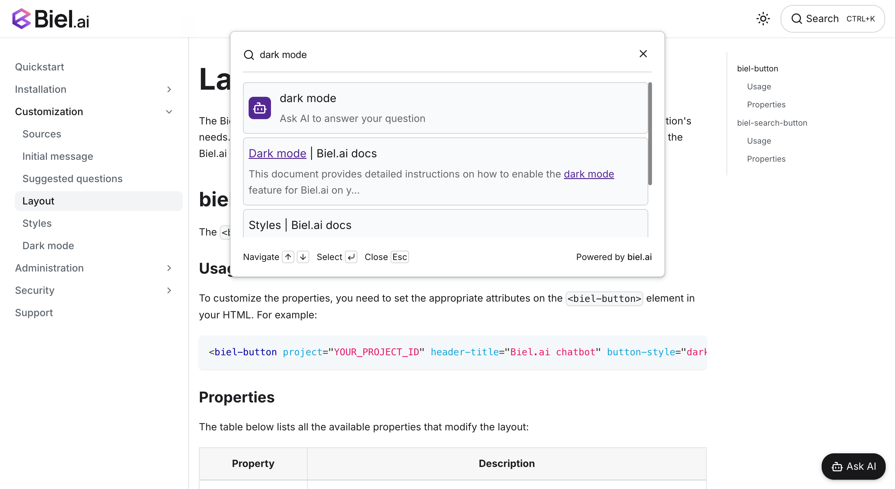

# Search




The search widget provides a powerful way to help users find relevant content across your documentation. 
It can be configured as a standalone search interface or integrated with the chatbot interface through the search button.

For more information about the search button configuration, see [Layout](../customization/layout.mdx#biel-search-button).

## How search works

The search widget uses semantic search to find relevant content across your indexed sources. It considers multiple factors when ranking results:

- Page content
- Page title
- Meta keywords
- Meta description
- URL structure


## Metadata and keywords

You can enhance your content's searchability by adding relevant metadata and keywords. Here are some examples:

```html
<!-- Basic metadata -->
<meta name="description" content="Learn how to configure and customize your Biel.ai chatbot">
<meta name="keywords" content="chatbot, configuration, customization, Biel.ai, setup">
```

## Boosting search results

You can influence the ranking of specific pages in search results by adding a `biel:boost_score` meta tag to your HTML. 
This allows you to prioritize important content in search results.

```html
<meta name="biel:boost_score" content="1.0">
```

The boost score is added to the page's base ranking score:
- Positive values (e.g., 1.0) will increase the page's ranking
- Negative values (e.g., -1.0) will decrease the page's ranking
- A value of 0 (default) maintains the normal ranking

:::important
Pages with a final ranking score below 0.8 will not appear in search results. 
Setting a boost score of -1.0 is typically enough to prevent a page from showing in search results.
:::

## Best practices

1. **Use descriptive titles**: Ensure your page titles clearly describe the content
2. **Add meta descriptions**: Provide concise summaries of page content
3. **Include keywords**: Add relevant keywords in meta tags
4. **Structure content**: Use proper heading hierarchy (h1, h2, etc.)
5. **Optimize URLs**: Use clear, descriptive URLs that reflect the content

## Limitations

The search widget only works with website content. Files (PDF, Word, Excel, etc.) are not searchable, even if they are indexed as sources.
