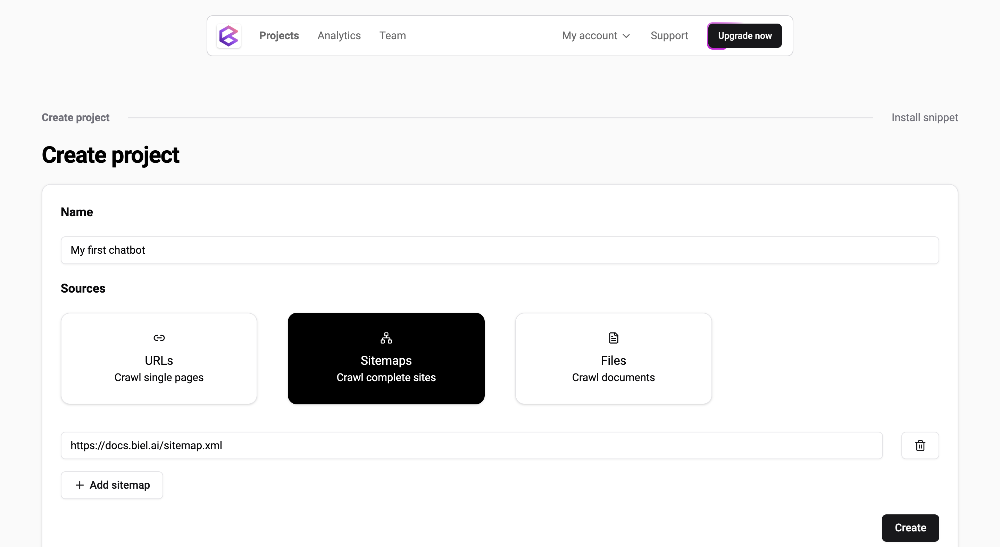
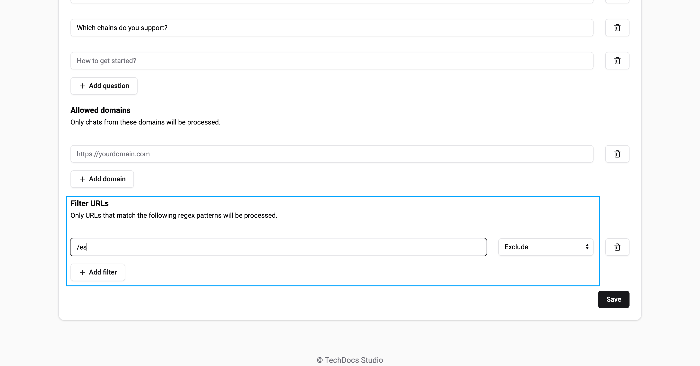

# Sources

In Biel.ai, you can configure various types of sources to index content for your chatbot to reference.
These sources allow the chatbot to provide accurate and relevant answers based on the content you want to make accessible. Each source type serves different needs, depending on the scope of content you want to index.

This guide will explain the different source types, when to use them, and how to configure each.

:::important  
Only users with the **Administrator** or **Maintainer** role can manage projects. For more details, see [Manage roles](roles.md).  
:::

## Source types

### 1. URLs

Use this method when you want to index specific **individual web pages**. 
It's ideal for cases where you need the chatbot to reference a particular piece of content, such as a blog post, article, or landing page.

**Key points:**
- Best for single-page indexing.
- Not suitable for indexing an entire website. If you plan to index an entire website or a large number of pages, **using a sitemap is recommended**.

### 2. Sitemaps

If you need to index an **entire website** or multiple pages at once, use the sitemap method.
Sitemaps are XML files that contain a list of all the pages on your website, allowing Biel.ai to automatically crawl and index them.

**Key points:**
- Ideal for large websites with multiple pages.
- Supports nested sitemaps, allowing comprehensive indexing of large sites.
- Sitemaps must end with `.xml`.

### 3. Files

Use this method to upload and index various document formats, such as:

* PDF
* CSV
* Excel
* Word
* TXT
* MD

It is useful when you want the chatbot to reference information from static documents.

**Key points:**
- File formats accepted include `.pdf`, `.word`, `.csv`, `.xls`, `.md`, and `.txt`.
- Files remain private and only accessible by the chatbot to generate responses.
- Widgets will not expose link to the files as sources or search results.
- This feature is currently under development and will be available soon.

## Manage sources

Regardless of the source type, configuring sources in Biel.ai follows a similar process. Here’s a general guide on how to add a source to your project:

1. Open [app.biel.ai](https://app.biel.ai).
2. Log in with your account credentials.
3. In the dashboard, click **Projects** in the top navigation bar.
4. Find and select your project from the list.
5. Click **Settings**.
6. In the **Sources** section, choose the type of source you want to add (URL, Sitemap, or Files):
    

    - For **URLs**, enter the full URL of the web page you want to index.
    - For **Sitemaps**, enter the URL of the `.xml` file that lists the pages to index.
    - For **Files** (coming soon), you will be able to upload documents directly.
7. Click **Save** to apply your changes.

Once saved, Biel.ai will start indexing the content from the selected source(s). You can verify the setup by interacting with the chatbot and seeing if it references the indexed content in its responses.

## Exclude URLs

When setting up a chatbot for documentation, it’s important to ensure it retrieves only relevant information from your knowledge base.

The **Filter URLs** feature lets you specify which URL patterns the chatbot should include or exclude. 

To filter sources, follow these steps:

1. Open [app.biel.ai](https://app.biel.ai).
2. Log in with your account credentials.
3. In the dashboard, click **Projects** in the top navigation bar.
4. Find and select your project from the list.
5. Click **Settings**.
6. In the **Sources** section, scroll to **Restrictions > Filter URLs**.
7. Add patterns to include or exclude as needed:
    
    
    Examples:
    * Setting `/es` to `Exclude` will prevent the chatbot from crawling any pages containing `/es` in the URL.
    * Setting `/es` to `Include` will only include pages that contain `/es` in the URL.
    * Setting `/es` to `Include` and `/post` to `Exclude` will only include pages that contain `/es`, excluding those that also contain `/post`.
    * Using a regex pattern such as `^https://example.com/docs/old/.*$` with `Exclude` will filter out all URLs under the `/docs/old/` path.

7. Click **Save** to apply your changes.

This filtering option allows you to refine the chatbot’s knowledge base, ensuring that users only access relevant documentation content.

