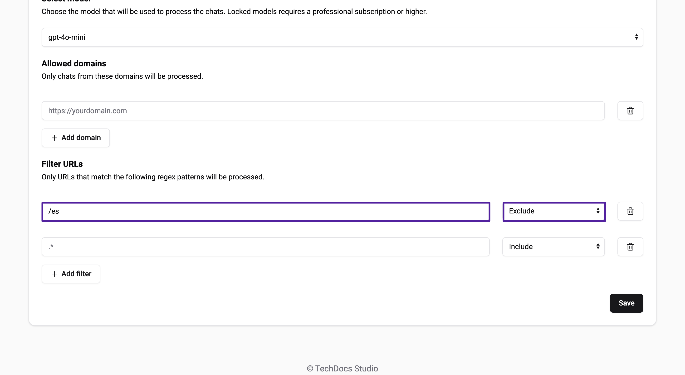

# Sources

In Biel.ai, you can configure various types of sources to index content for your chatbot to reference.
These sources allow the chatbot to provide accurate and relevant answers based on the content you want to make accessible. Each source type serves different needs, depending on the scope of content you want to index.

This guide will explain the different source types, when to use them, and how to configure each.

## Source Types

### 1. **URL sources (single pages)**

**When to use:**  
Use this method when you want to index specific individual web pages. It's ideal for cases where you need the chatbot to reference a particular piece of content, such as a blog post, article, or landing page.

- **Example:** You want to index your FAQ page, a product description page, or a particular blog post.

**Key points:**
- Best for single-page indexing.
- Not suitable for indexing an entire website.

### 2. **Sitemap sources (complete websites)**

**When to use:**  
If you need to index an entire website or multiple pages at once, use the sitemap method. Sitemaps are XML files that contain a list of all the pages on your website, allowing Biel.ai to automatically crawl and index them.

- **Example:** You want to index all the pages on your website or all blog posts listed in a sitemap.

**Key points:**
- Ideal for large websites with multiple pages.
- Supports nested sitemaps, allowing comprehensive indexing of large sites.
- Sitemaps must end with `.xml`.

:::important
If you plan to index an entire website or a large number of pages, **using a sitemap is recommended** to ensure efficient and thorough indexing.
:::

### 3. **File sources (coming soon)**

**When to use:**  
This feature will allow you to upload and index various document formats, such as:

* PDF
* CSV
* Excel
* Word
* Text files

It is useful when you want the chatbot to reference information from static documents.

- **Example:** Upload a product manual in PDF format or a terms and conditions document.

**Key points:**
- Ideal to parse content that is not available on public websites.
- This feature is currently under development and will be available soon.

## Configuring sources

Regardless of the source type, configuring sources in Biel.ai follows a similar process. Here’s a general guide on how to add a source to your project:

Regardless of the source type, configuring sources in Biel.ai follows a similar process. Here’s a general guide on how to add a source to your project:

1. Open [app.biel.ai](https://app.biel.ai).
2. Log in with your account credentials.
3. In the dashboard, click **Projects** in the top navigation bar.
4. Find and select your project from the list.
5. Click **Settings**.
6. In the **Sources** section, choose the type of source you want to add (URL, Sitemap, or Files):
    

    - For **URLs**, enter the full URL of the web page you want to index.
    - For **Sitemaps**, enter the URL of the `.xml` file that lists the pages to index.
    - For **Files** (coming soon), you will be able to upload documents directly.
7. Click **Save** to apply your changes.

Once saved, Biel.ai will start indexing the content from the selected source(s). You can verify the setup by interacting with the chatbot and seeing if it references the indexed content in its responses.

## Filtering sources

When implementing a chatbot for documentation, ensuring it retrieves relevant information from a large, complex knowledge base is crucial.
Biel AI provides a **Filter Sources** feature that allows you to define specific URL patterns the chatbot should include or exclude.
By focusing only on pertinent content, this feature improves both the chatbot's accuracy and user experience by preventing irrelevant pages from entering the chatbot’s scope.

To filter sources, follow these steps:

1. Open [app.biel.ai](https://app.biel.ai).
2. Log in with your account credentials.
3. In the dashboard, click **Projects** in the top navigation bar.
4. Find and select your project from the list.
5. Click **Settings**.
6. In the **Sources** section, scroll to **Filter URLs**.
7. Add patterns to include or exclude as needed:
    
    
    For example, setting `/es` to `Exclude` will prevent the chatbot from crawling any pages containing `/es` in the URL.
7. Click **Save** to apply your changes.

