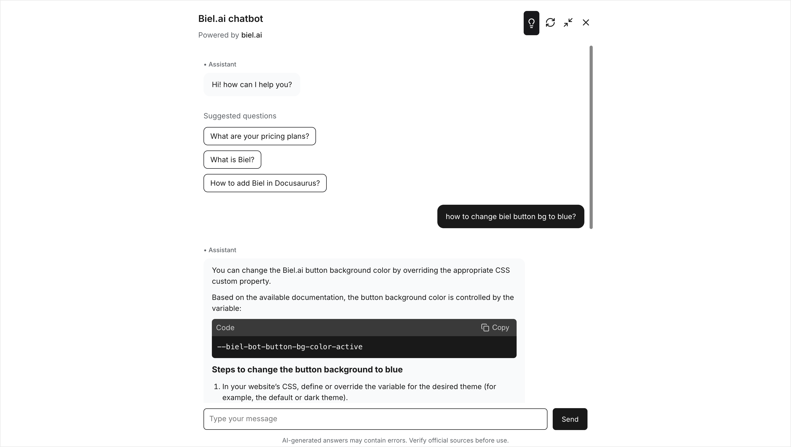

# Think mode

:::note Beta feature
The think mode is currently in beta and available for early adopters. We're actively working on improving its performance.
:::

Control how the AI reasons through questions with three distinct modes: Auto, Instant, and Think.



## Reasoning modes

Your chat widget includes a settings button that lets users choose their preferred reasoning depth:

**Auto (default)**
- Balances speed and quality
- Lets the system determine the appropriate reasoning depth
- Good for most questions

**Instant**
- Instant answers for quick lookups
- Best for simple questions and single parameter definitions
- Uses minimal computational resources

**Think**
- Takes longer for better accuracy
- Deep reasoning for complex technical questions
- Best when accuracy matters more than speed
- Uses 4-8x more interactions per question

## Performance trade-offs

Each reasoning mode has different speed and usage characteristics:

| Metric | Auto/Fast | Think |
|--------|-----------|-------|
| Response time | ~1-4 seconds | ~8 seconds - 1 minute |
| Interactions used | 1 per question | 4-8 per question |
| Best for | Quick lookups | Complex analysis |

:::info
Each interaction counts toward your plan's usage limits. Think mode uses 4-8x more interactions than Auto or Fast mode.
:::

## Availability

Think mode is available on:
- ✅ **Growth, Professional, and Business plans**
- ✅ **Demo mode** (for testing)
- ❌ **Starter plan** (not available due to higher computational cost)

## How to enable

### Step 1: Enable in Project Settings

:::note
Only users with the Administrator or Maintainer role can manage projects. For more details, see [Manage roles](../administration/roles.md).
:::

1. Navigate to your project page
2. Click the **Settings** button
3. Scroll to the **LLM Settings** section
4. Check **Enable think mode**
5. Click **Save**


This makes think mode available as an option for users in your chat interface.

### Step 2: Using think mode

Once enabled, users can activate think mode for specific questions:

**In the Chat Widget:**
- Look for the lightbulb icon (💡) in the header
- Click to toggle think mode on/off
- Preference is saved across page reloads


## Customization options

You can customize think mode behavior:

```html
<!-- Hide the think mode button entirely -->
<biel-search
  project="my-project"
  hideThinkModeButton="true"
></biel-search>

<!-- Enable think mode by default -->
<biel-search
  project="my-project"
  thinkModeEnabled="true"
></biel-search>
```

:::tip
To force think mode on for all questions without letting users toggle it off, combine both options:

```html
<biel-search
  project="my-project"
  thinkModeEnabled="true"
  hideThinkModeButton="true"
></biel-search>
```

This ensures maximum answer quality but increases interaction usage by 4-8x for every question.
:::
