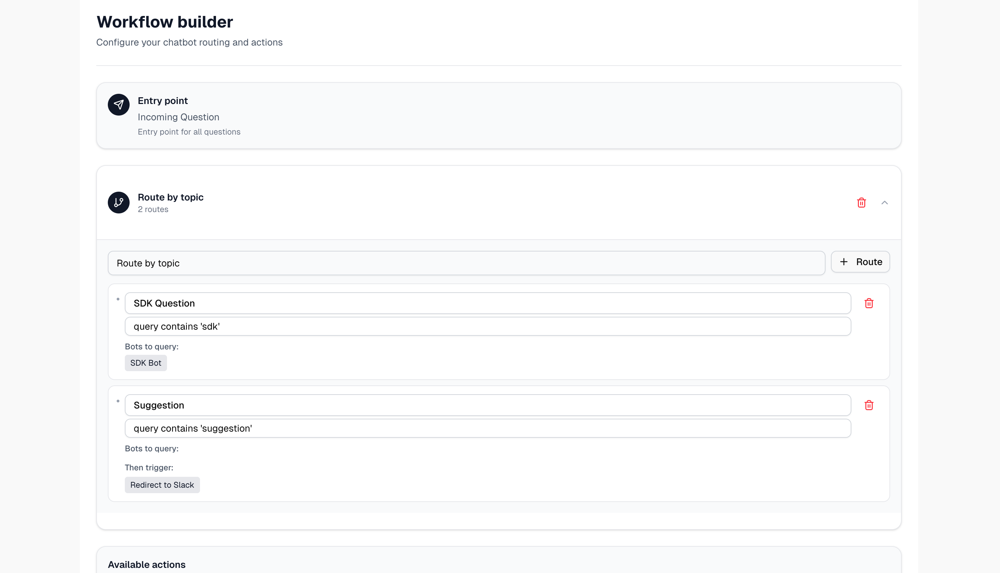
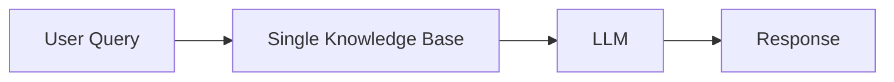
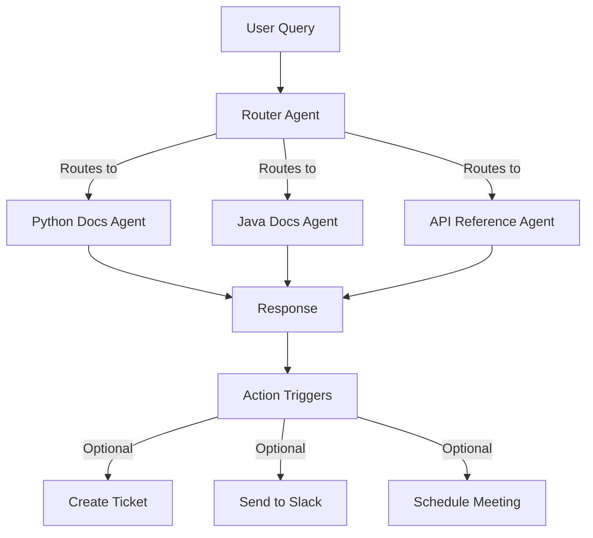

# Workflows (Agentic RAG for Documentation)


Workflows connect multiple Biel.ai projects into a single chatbot interface, with each project focused on a specific domain or knowledge area.
Instead of training a single project on vastly different topics, workflows use intelligent routing to direct queries to the most appropriate specialized agent.



Think of it as having a team of specialists rather than a single generalist.
Each project maintains its own documentation sources, model configuration, and custom prompts, while the workflow coordinates which agent handles each query and can trigger external actions based on conversation context.


:::important
This feature is available exclusively on **Enterprise** plans. [Contact us](https://biel.ai/contact) to learn more about enterprise solutions.
:::

## How workflows work

Workflows use multiple specialized agents instead of a single knowledge base.

**Single project:**



**Workflow with routing and actions:**



The router analyzes each query and sends it to the appropriate specialized agent. Each agent has its own knowledge base and can trigger different actions based on the conversation.

## When to use workflows

Workflows are ideal when you need:

### Multiple documentation domains

**Separate projects by language:**
- **Use case**: SDK documentation in Python, JavaScript, Java, and Go
- **Why it helps**: Users asking Python questions only see Python examples
- **Setup**: Create one project per language with keywords (`python`, `pip`, `js`, `npm`, `java`, `maven`)

**Split by product:**
- **Use case**: Multiple products with distinct features (e.g., Product A for analytics, Product B for collaboration)
- **Why it helps**: Each product gets focused, accurate responses without irrelevant information
- **Setup**: One project per product with specific keywords and fallback to query both if unclear

**Organize by documentation type:**
- **Use case**: API reference, end-user guides, and admin documentation
- **Why it helps**: Routes technical queries to API docs, UI questions to user guides
- **Setup**: Separate projects for each documentation type with topic-based routing

### Large documentation sets

For documentation over 1000 pages:
- Split into domain-specific projects for better accuracy
- Each specialized agent focuses on a narrower context
- Easier to maintain and update individual sections

### Custom actions and integrations

Automatically trigger actions based on conversation context:
- **Bug reports**: Create Zendesk ticket + notify team on Slack
- **Demo requests**: Send webhook to Calendly for scheduling
- **Pricing inquiries**: Create CRM lead + notify sales team
- **Feature requests**: Log to Jira + send confirmation email

## When not to use workflows

Use a single project instead if:
- Documentation under 1000 pages covering one cohesive topic
- Content is naturally interconnected (all features of one product)
- No need for custom actions or external integrations

## Setting up a workflow

:::tip Enterprise setup included
As part of your enterprise agreement, our team handles the initial workflow configuration to ensure everything works correctly from the start.

We'll work with you to define routing rules, configure integrations, and test the setup before going live.
:::

### Prerequisites

Before creating a workflow, ensure you have:

* At least two existing projects with indexed content
* A clear understanding of how queries should be routed
* (Optional) Webhook endpoints ready if you plan to use custom actions

### Create your workflow

1. Log in to your Biel.ai account and navigate to your dashboard.

2. Click **Workflows** in the top navigation bar.

3. Click **Create workflow**.

4. Configure your workflow:

   - **Name**: A descriptive identifier for your workflow (e.g., "Product Suite Assistant")
   - **Description**: Internal notes about the workflow's purpose

5. Click **Create**.

### Add projects

1. In your workflow settings, navigate to the **Projects** section.

2. Click **Add project**.

3. Select a project from your existing projects.

4. Define when this project should be used:

   - **Keywords**: Terms that indicate this project should handle the query
   - **Topics**: High-level categories this project covers
   - **Priority**: Ranking when multiple projects could match

5. Repeat for each project you want to include.

6. Click **Save**.

### Configure routing rules

1. Navigate to **Routing rules** in your workflow settings.

2. Click **Add rule**.

3. Define your rule:

   ```
   Name: API Questions
   Condition: Query contains ["API", "endpoint", "authentication", "integration"]
   Action: Route to "Developer Documentation" project
   Priority: High
   ```

4. Add multiple rules to cover different scenarios.

5. Set a fallback strategy:
   - **Query all projects**: Combines responses from all relevant projects
   - **Default project**: Routes to a general knowledge project
   - **Request clarification**: Asks the user to rephrase

6. Click **Save**.

### Set up custom actions (optional)

1. Navigate to **Actions** in your workflow settings.

2. Click **Add action**.

3. Configure your action:

   - **Action type**: Choose from available integrations:
     - **Slack** - Send messages to channels or users
     - **Microsoft Teams** - Post to Teams channels
     - **Email** - Send notifications to team members
     - **Zendesk** - Create support tickets automatically
     - **Webhook** - Post to any custom endpoint
     - More integrations available based on your plan
   - **Trigger condition**: Define when this action should fire
   - **Configuration**: Provide credentials and integration details

6. Click **Save**.

## Testing your workflow

Before deploying your workflow, test it thoroughly:

1. In your workflow dashboard, click **Test**.

2. Enter sample queries that should trigger different projects:
   - Questions that match specific routing rules
   - Queries that should trigger custom actions
   - Edge cases that require fallback handling

3. Review the routing decisions and responses.

4. Adjust rules and priorities as needed.

## Deploying your workflow

Once your workflow is configured and tested:

1. In your workflow settings, navigate to **Deployment**.

2. Copy the workflow embed code.

3. Add this code to your website where you want the chatbot to appear.

4. The workflow chatbot will replace or supplement your existing chatbot implementation.

## Best practices

- **Start small**: Begin with 2-3 projects, add more as needed
- **Keep projects focused**: Each project should cover one clear topic area
- **Test regularly**: Try queries that might match multiple projects
- **Monitor analytics**: Check which projects handle the most queries
- **Update routing rules**: Refine keywords based on actual user questions

## Supported integrations

Workflows can trigger actions in these platforms:

- **Communication**: Slack, Microsoft Teams, Email, Discord
- **Ticketing**: Zendesk, Jira, ServiceNow, Freshdesk
- **CRM**: Salesforce, HubSpot
- **Scheduling**: Calendly, Cal.com
- **Analytics**: Segment, Mixpanel, Google Analytics
- **Webhooks**: Any HTTP endpoint

For custom integrations, contact [info@biel.ai](mailto:info@biel.ai).

## Getting help

For workflow setup assistance, see [Support](../support.mdx).
