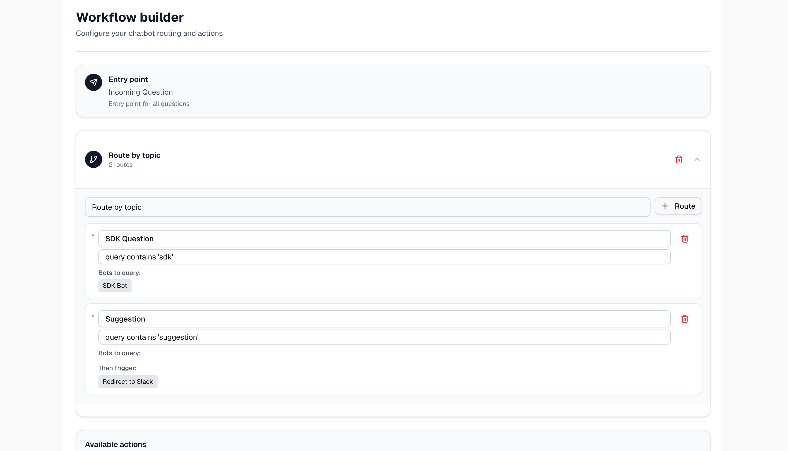
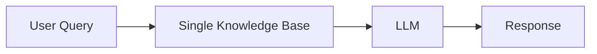
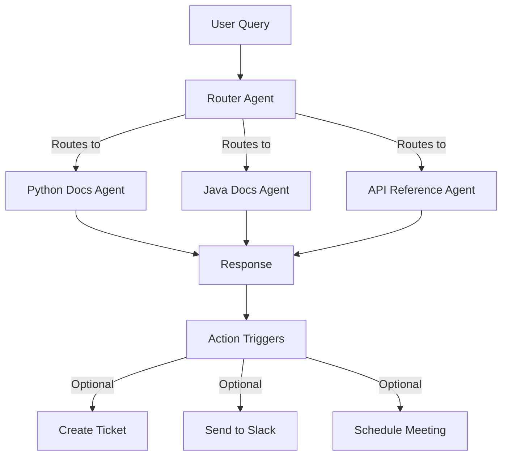

# Workflows (Agentic RAG for Documentation)


Workflows connect multiple Biel.ai projects into a single chatbot interface. Each project covers a specific domain, and a router directs queries to the most appropriate one. Projects maintain their own sources, model configuration, and custom prompts.




:::important
This feature is available exclusively on **Enterprise** plans. [Contact us](https://biel.ai/contact) to learn more about enterprise solutions.
:::

## How workflows work

**Single project:**


```mermaid
graph LR
    A[User Query] --> B[Single Knowledge Base]
    B --> C[LLM]
    C --> D[Response]
```

**Workflow with routing and actions:**


```mermaid
graph TB
    A[User Query] --> B[Router Agent]
    B -->|Routes to| C[Python Docs Agent]
    B -->|Routes to| D[Java Docs Agent]
    B -->|Routes to| E[API Reference Agent]
    C --> F[Response]
    D --> F
    E --> F
    F --> G[Action Triggers]
    G -->|Optional| H[Create Ticket]
    G -->|Optional| I[Send to Slack]
    G -->|Optional| J[Schedule Meeting]
```

The router analyzes each query and directs it to the appropriate agent. Agents can also trigger external actions (tickets, notifications, etc.) based on conversation context.

## When to use workflows

| Scenario | Example | Why workflows help |
|----------|---------|-------------------|
| Multiple languages/SDKs | Python, JavaScript, Java docs | Users only see relevant examples |
| Multiple products | Product A (analytics), Product B (collaboration) | Focused responses without cross-contamination |
| Different doc types | API reference, user guides, admin docs | Routes technical queries to API docs, UI questions to guides |
| Large doc sets (1000+ pages) | Enterprise documentation | Splitting by domain improves accuracy |
| Custom actions | Bug reports → Zendesk, demo requests → Calendly | Trigger integrations based on conversation context |

Use a single project instead if your docs are under 1000 pages, cover one cohesive topic, and don't need external integrations.

## Setting up a workflow

:::tip Enterprise setup included
As part of your enterprise agreement, our team handles the initial workflow configuration to ensure everything works correctly from the start.

We'll work with you to define routing rules, configure integrations, and test the setup before going live.
:::

### Prerequisites

- At least two existing projects with indexed content.
- (Optional) Webhook endpoints for custom actions.

### Create your workflow

1. In the [Biel.ai dashboard](https://app.biel.ai), click **Workflows** > **Create workflow**.
2. Enter a **Name** and optional **Description**.
3. Click **Create**.

### Add projects

1. In your workflow settings, navigate to the **Projects** section.

2. Click **Add project**.

3. Select a project from your existing projects.

4. Define when this project should be used:

   - **Keywords**: Terms that indicate this project should handle the query
   - **Topics**: High-level categories this project covers
   - **Priority**: Ranking when multiple projects could match

5. Repeat for each project you want to include.

6. Click **Save**.

### Configure routing rules

1. Navigate to **Routing rules** in your workflow settings.

2. Click **Add rule**.

3. Define your rule:

   ```
   Name: API Questions
   Condition: Query contains ["API", "endpoint", "authentication", "integration"]
   Action: Route to "Developer Documentation" project
   Priority: High
   ```

4. Add multiple rules to cover different scenarios.

5. Set a fallback strategy:
   - **Query all projects**: Combines responses from all relevant projects
   - **Default project**: Routes to a general knowledge project
   - **Request clarification**: Asks the user to rephrase

6. Click **Save**.

### Set up custom actions (optional)

1. Navigate to **Actions** in your workflow settings.
2. Click **Add action**.
3. Configure your action:
   - **Action type**: Slack, Microsoft Teams, Email, Zendesk, Webhook, or other available integrations.
   - **Trigger condition**: When this action should fire.
   - **Configuration**: Credentials and integration details.
4. Click **Save**.

## Test your workflow

1. In the workflow dashboard, click **Test**.
2. Enter sample queries that should trigger different projects, including edge cases and action triggers.
3. Review routing decisions and responses.
4. Adjust rules and priorities as needed.

## Deploy your workflow

1. In your workflow settings, navigate to **Deployment**.
2. Copy the embed code and add it to your website.

## Supported integrations

| Category | Platforms |
|----------|-----------|
| Communication | Slack, Microsoft Teams, Email, Discord |
| Ticketing | Zendesk, Jira, ServiceNow, Freshdesk |
| CRM | Salesforce, HubSpot |
| Scheduling | Calendly, Cal.com |
| Analytics | Segment, Mixpanel, Google Analytics |
| Custom | Any HTTP endpoint via webhooks |
