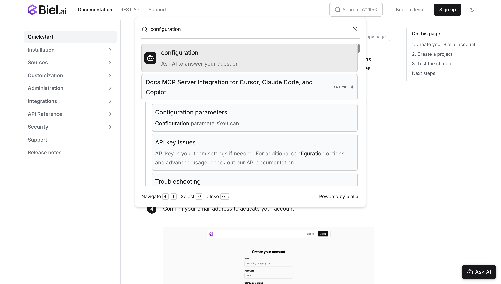

import Tabs from '@theme/Tabs';
import TabItem from '@theme/TabItem';

# AI chatbot for Docusaurus

Biel.ai is an advanced chatbot designed to transform the way users interact with your technical documentation.
By leveraging AI, Biel.ai delivers instant, context-rich answers, making your documentation more accessible and reducing the need for repetitive support tasks.

Here's a step-by-step guide to help you install Biel.ai in your Docusaurus project using NPM.

## Prerequisites

Before you begin, you'll need to have the following:

- A Biel.ai account. If you don't have one, [sign up for free](https://app.biel.ai/accounts/signup/).
- A project created in your Biel.ai dashboard. If you haven't created one yet, follow the steps in the [Quickstart](../quickstart.md#2-create-a-project) guide.
- A Docusaurus site and Node.js installed.

## Installation

The Biel.ai widget enables a conversational chat powered by AI in your site.


To integrate the Biel.ai widget into your Docusaurus site:

1. Open your terminal or command prompt. Navigate to your project's root directory using the `cd` command:

    ```console
    cd path/to/your/project
    ```
    
    Replace `path/to/your/project` with your project's actual directory path.

1. With your terminal still open, run the following command to install Biel.ai extension for Docusaurus:

    ```console
    npm install docusaurus-biel
    ```
    
1. Add the plugin to your Docusaurus config file `docusaurus.config.js`:

    ```js
    plugins: [
        [
            'docusaurus-biel',{
                project: '<YOUR_PROJECT_ID>',
                headerTitle: 'Biel.ai chatbot',
                version: 'latest'
            }
        ]
    ],
    ```

    Replace `<YOUR_PROJECT_ID>` with your project's ID from the [Biel.ai dashboard](../quickstart.md#2-create-a-project).

1. Start your Docusaurus project by running `npm start` or `yarn start` in your terminal. Once it compiles successfully, verify that the chatbot appears and functions correctly on your site.

## Customization

You can customize the Biel.ai widget to suit your needs. For example, you can change the widget's position, color, and more.

To do so, you can add any of the following [customization](../customization/layout.mdx) options to the plugin or formatted as camelCase.

Here's an example:

```js
plugins: [
    [
        'docusaurus-biel',{
            enable: true,
            project: '<YOUR_PROJECT_ID>',
            buttonPosition: 'center-right',
            modalPosition: 'sidebar-right',
            headerTitle: 'Biel.ai chatbot'
            buttonStyle: 'dark',
        }
    ]
],
```

To further customize the style of the Biel.ai widget in Docusaurus, such as altering the widget's background color, you can override specific CSS properties. This is done by defining these properties in a custom stylesheet. Here's how you can do it:

1. In your project's `src` directory, create the file `css/custom.css`.

1. In the `custom.css` file, you can define your custom CSS properties. For example, to change the widget's primary color, add the following CSS rule:

    ```css
    :root {
        --biel-primary-color: #FF0000; /* Replace #FF0000 with the hex color code of your choice */
    }
    ```

    For a complete reference of properties you can modify, see the [Styles](../customization/styles) documentation.

1. Open your `docusaurus.config.js` file and locate the `presets` array and within it, the `classic` preset configuration. Then, add a reference to your custom stylesheet in the theme configuration. It should look something like this:

    ```js
    presets: [
        [
            'classic',
            {
            // ... other configurations ...
            theme: {
                customCss: require.resolve('./src/css/custom.css'), // Add this line
            },
            // ... other configurations ...
            },
        ],
    ],
    ```

## Advanced: Enable AI search

Biel.ai's search widget offers a search-based interaction that allows users to query documentation or other indexed content.



To integrate the search widget into your Docusaurus site, follow these steps:

1. Open your terminal or command prompt. Navigate to your project's root directory using the `cd` command:

    ```console
    cd path/to/your/project
    ```
    
    Replace `path/to/your/project` with your project's actual directory path.

2. With your terminal still open, run the following command to install Biel.ai extension for Docusaurus:

    ```console
    npm install docusaurus-biel
    ```

3. Swizzling allows you to customize the `SearchBar` component. Run this command:

    ```console
    npm run swizzle @docusaurus/theme-classic SearchBar
    ```
    
    * When prompted with the question: `Which language do you want to use?`, choose **TypeScript**.
    * When prompted with the question: `Which swizzle action do you want to do?`, choose **Eject** to extract the `SearchBar` component into the `src/theme` directory.

4. Open the file at `src/theme/SearchBar.tsx` and replace its content with the following:

    ```tsx
    import React from 'react';

    export default function SearchBar() {
        // Replace with your <PROJECT_ID>
        const projectId = '<PROJECT_ID>';
        const headerTitle = 'Documentation chatbot';
        // @ts-ignore: Not a React component
        return <biel-search-button project={projectId} button-style="rounded" header-title={headerTitle}>Search</biel-search-button>;
    }
    ```

    Replace `<PROJECT_ID>` with your project's ID from the [Biel.ai dashboard](../quickstart.md#2-create-a-project).


5. Run your Docusaurus site to verify the changes:

    ```console
    npm run start
    ```

6. Check that the Biel.ai search widget appears and functions correctly on your site.

7. (Optional) If you want to hide the floating widget and use only the Biel.ai search bar, you can disable the floating button by adding the following option to your `docusaurus.config.js` file:

    ```js
    plugins: [
        [
            'docusaurus-biel', {
                enable: false,
                project: '<YOUR_PROJECT_ID>',
                headerTitle: 'Biel.ai chatbot',
                version: 'latest'
            }
        ]
    ],
    ```

## Need help?

We're here to help! Reach out to us at [Biel.ai Support](https://biel.ai/contact).
