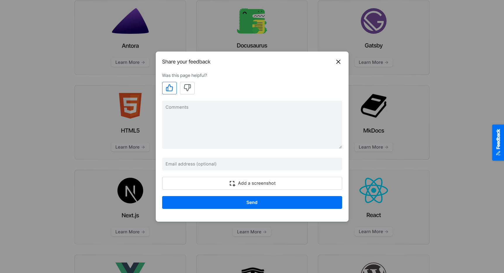
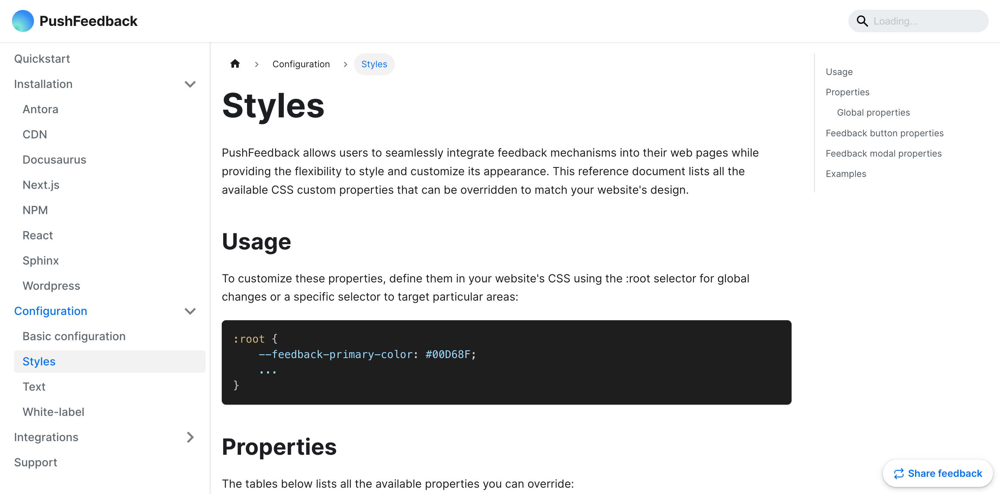

import Tabs from '@theme/Tabs';
import TabItem from '@theme/TabItem';

# AI chatbot for Docusaurus

Here's a step-by-step guide to help you install Biel.ai in your Docusaurus project using NPM.



## Prerequisites

Before you begin, you'll need to have the following:

- A Biel.ai account. If you don't have one, [sign up for free](https://app.biel.ai/accounts/signup/).
- A project created in your Biel.ai dashboard. If you haven't created one yet, follow the steps in the [Quickstart](../quickstart.md#2-create-a-project) guide.
- A Docusaurus site and Node.js installed.

## Installation

To integrate the Biel.ai widget into your Docusaurus site:

1. Open your terminal or command prompt. Navigate to your project's root directory using the `cd` command:

    ```console
    cd path/to/your/project
    ```
    
    Replace `path/to/your/project` with your project's actual directory path.

1. With your terminal still open, run the following command to install Biel.ai:

    ```console
    npm install docusaurus-biel
    ```
    
1. Add the plugin to your Docusaurus config file `docusaurus.config.js`:

    ```js
    plugins: [
        [
            'docusaurus-biel',{
                project: '<YOUR_PROJECT_ID>'
            }
        ]
    ],
    ```

    Replace `<YOUR_PROJECT_ID>` with your project's ID from the [Biel.ai dashboard](../quickstart.md#2-create-a-project).

1. Start your Docusaurus project by running `npm start` or `yarn start` in your terminal. Once it compiles successfully, verify that the chatbot appears and functions correctly on your site.

    

## Customization

You can customize the Biel.ai widget to suit your needs. For example, you can change the widget's position, color, and more.

To do so, you can add any of the following [configuration](../configuration/layout.mdx) and [text](../configuration/text.mdx) options to the plugin or formatted as camelCase.

Here's an example:

```js
plugins: [
    [
        'docusaurus-pushfeedback',{
            project: '<YOUR_PROJECT_ID>',
            buttonPosition: 'center-right',
            modalPosition: 'sidebar-right',
            buttonStyle: 'dark',
            modalTitle: 'Share your thoughts'
        }
    ]
],
```

To further customize the style of the Biel.ai widget in Docusaurus, such as altering the widget's background color, you can override specific CSS properties. This is done by defining these properties in a custom stylesheet. Here's how you can do it:

1. In your project's `src` directory, create the file `css/custom.css`.

1. In the `custom.css` file, you can define your custom CSS properties. For example, to change the widget's primary color, add the following CSS rule:

    ```css
    :root {
        --feedback-primary-color: #FF0000; /* Replace #FF0000 with the hex color code of your choice */
    }
    ```

    For a complete reference of properties you can modify, see the [Styles](../configuration/styles) documentation.

1. Open your `docusaurus.config.js` file and locate the `presets` array and within it, the `classic` preset configuration. Then, add a reference to your custom stylesheet in the theme configuration. It should look something like this:

    ```js
    presets: [
        [
            'classic',
            {
            // ... other configurations ...
            theme: {
                customCss: require.resolve('./src/css/custom.css'), // Add this line
            },
            // ... other configurations ...
            },
        ],
    ],
    ```

