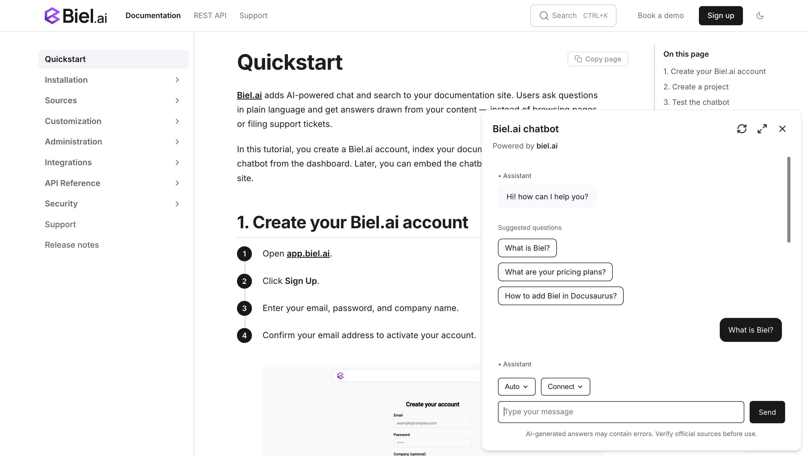
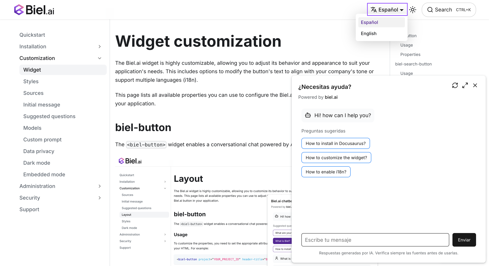

import Tabs from '@theme/Tabs';
import TabItem from '@theme/TabItem';

# Ask AI chatbot widget for Docusaurus

Add a Biel.ai [AI chatbot](https://biel.ai) or [AI search widget](https://biel.ai/ai-search-for-docs) to your Docusaurus v3 site using the `docusaurus-biel` plugin.

## Prerequisites

- A [Biel.ai account](https://app.biel.ai/accounts/signup/).
- A [project](../quickstart.md#2-create-a-project) with indexed content.
- A Docusaurus v3 site.
- Node.js installed.

## Add the chatbot widget

The `docusaurus-biel` plugin adds a floating chat button to your site.



1. Install the plugin:

    ```console
    npm install docusaurus-biel
    ```

2. Add the plugin to `docusaurus.config.js`:

    ```js
    plugins: [
        [
            'docusaurus-biel',{
                project: '<YOUR_PROJECT_ID>',
                headerTitle: 'Biel.ai chatbot',
                version: 'latest'
            }
        ]
    ],
    ```

    Replace `<YOUR_PROJECT_ID>` with your project's ID from the [Biel.ai dashboard](../quickstart.md#2-create-a-project).

3. Run `npm start` and verify the chatbot appears on your site.

## Customization

Pass [layout options](../customization/layout.mdx) to the plugin as camelCase properties:

```js
plugins: [
    [
        'docusaurus-biel',{
            enable: true,
            project: '<YOUR_PROJECT_ID>',
            bielButtonText: 'ASK AI',
            buttonPosition: 'center-right',
            modalPosition: 'sidebar-right',
            headerTitle: 'Biel.ai chatbot',
            buttonStyle: 'dark',
        }
    ]
],
```

To override the widget's styles (colors, fonts, etc.), add CSS custom properties to your `src/css/custom.css` file:

```css
:root {
    --biel-primary-color: #FF0000;
}
```

See [Styles](../customization/styles) for the full list of CSS properties.

:::tip[Docusaurus not loading your custom CSS?]
Make sure `custom.css` is referenced in `docusaurus.config.js` under the `classic` preset:

```js
presets: [
    [
        'classic',
        {
            theme: {
                customCss: require.resolve('./src/css/custom.css'),
            },
        },
    ],
],
```
:::

## Add the search widget

The search widget replaces the default Docusaurus search bar with Biel.ai's AI-powered search.


1. Install the plugin:

    ```console
    npm install docusaurus-biel
    ```

2. Eject the `SearchBar` component using [swizzling](https://docusaurus.io/docs/swizzling):

    ```console
    npm run swizzle @docusaurus/theme-classic SearchBar
    ```

    When prompted, choose **TypeScript** and **Eject**.

3. Open `src/theme/SearchBar.tsx` and replace its content with:

    ```tsx
    import React from 'react';

    export default function SearchBar() {
        const projectId = '<PROJECT_ID>';
        const headerTitle = 'Documentation chatbot';
        // @ts-ignore: Not a React component
        return <biel-search-button project={projectId} button-style="rounded" header-title={headerTitle}>Search</biel-search-button>;
    }
    ```

    Replace `<PROJECT_ID>` with your project's ID from the [Biel.ai dashboard](../quickstart.md#2-create-a-project).

4. Run `npm start` and verify the search widget appears in the navbar.

:::tip[Using search without the chatbot?]
Set `enable: false` in the `docusaurus-biel` plugin config to hide the floating chat button:

```js
plugins: [
    [
        'docusaurus-biel', {
            enable: false,
            project: '<YOUR_PROJECT_ID>',
            headerTitle: 'Biel.ai chatbot',
            version: 'latest'
        }
    ]
],
```
:::

## Multilingual support

If your Docusaurus site uses [i18n](https://docusaurus.io/docs/i18n/tutorial), you can localize the chatbot's UI strings per locale. This approach uses `biel-react` instead of the `docusaurus-biel` plugin.



1. Install `biel-react`:

    ```bash
    npm install biel-react
    ```

    :::tip[Already using docusaurus-biel?]
    This setup replaces it. Run `npm uninstall docusaurus-biel` to remove the plugin.
    :::

2. Wrap the Footer component using [swizzling](https://docusaurus.io/docs/swizzling) to inject the chatbot before the closing `</body>` tag:

    ```bash
    npm run swizzle @docusaurus/theme-classic Footer
    ```

    When prompted, choose **Wrap**.

3. Open `src/theme/Footer/index.js` and replace its content with:

    ```js
    import React, { useEffect } from 'react';
    import Footer from '@theme-original/Footer';
    import useDocusaurusContext from '@docusaurus/useDocusaurusContext';
    import { BielButton } from 'biel-react';
    import { defineCustomElements } from 'biel-search/loader';
    import 'biel-search/dist/biel-search/biel-search.css';

    function BielWidget() {
        const { i18n } = useDocusaurusContext();
        const language = i18n.currentLocale;
        const projectId = '<PROJECT_ID>'; // Replace with your actual project ID

        const placeholders = {
            en: {
                bielButtonText: "Ask AI",
                sendButtonText: 'Send',
                inputPlaceholderText: 'Type your message',
                error403: 'Oops! The request URL does not match the one defined for this project.',
                error404: 'Oops! We could not find the provided project ID.',
                errorDefault: 'Oops! Please try again later.',
                headerTitle: 'Need help?',
                footerText: 'AI generated answers. Always verify the sources before using them.',
                sourcesText: 'Sources',
                suggestedQuestions: "['What is Biel.ai?', 'How to install in Docusaurus?']",
                suggestedQuestionsTitle: 'Suggested questions',
                termsTitle: 'Chatbot Terms & Conditions',
                termsDescription: "Please review our <a href='https://biel.ai/terms' target='_blank' rel='noopener'>Terms & Conditions</a> before proceeding.",
                termsCheckboxText: 'I have read and agree to the Terms & Conditions.',
                welcomeMessage: 'Hello! How can I help you today?'
            },
            es: {
                bielButtonText: "Pregúntame",
                sendButtonText: 'Enviar',
                inputPlaceholderText: 'Escribe tu mensaje',
                error403: '¡Ups! La URL de solicitud no coincide con la definida para este proyecto.',
                error404: '¡Ups! No pudimos encontrar el ID de proyecto proporcionado.',
                errorDefault: '¡Ups! Por favor, intenta de nuevo más tarde.',
                headerTitle: '¿Necesitas ayuda?',
                footerText: 'Respuestas generadas por IA. Verifica siempre las fuentes antes de usarlas.',
                sourcesText: 'Fuentes',
                suggestedQuestions: "['¿Qué es Biel.ai', '¿Cómo instalar en Docusaurus?']",
                suggestedQuestionsTitle: 'Preguntas sugeridas',
                termsTitle: 'Términos y condiciones del chatbot',
                termsDescription: "Por favor revisa nuestros <a href='https://biel.ai/terms' target='_blank' rel='noopener'>Términos y Condiciones</a> antes de continuar.",
                termsCheckboxText: 'He leído y acepto los Términos y Condiciones.',
                welcomeMessage: '¡Hola! ¿En qué puedo ayudarte hoy?'
            }
        };

        const {
            bielButtonText,
            error403,
            error404,
            errorDefault,
            footerText,
            headerTitle,
            inputPlaceholderText,
            sendButtonText,
            sourcesText,
            suggestedQuestions,
            suggestedQuestionsTitle,
            termsCheckboxText,
            termsDescription,
            termsTitle,
            welcomeMessage,
        } = placeholders[language] || placeholders.en;

        useEffect(() => {
            if (typeof window !== 'undefined') {
                defineCustomElements(window);
            }
        }, []);

        return (
            <div className="biel-widget">
                <BielButton
                    project={projectId}
                    button-position="bottom-right"
                    button-style="dark"
                    modal-position="bottom-right"
                    error-message-4-0-3={error403}
                    error-message-4-0-4={error404}
                    error-message-default={errorDefault}
                    footer-text={footerText}
                    header-title={headerTitle}
                    input-placeholder-text={inputPlaceholderText}
                    send-button-text={sendButtonText}
                    sources-text={sourcesText}
                    suggested-questions={suggestedQuestions}
                    suggested-questions-title={suggestedQuestionsTitle}
                    terms-checkbox-text={termsCheckboxText}
                    terms-description={termsDescription}
                    terms-title={termsTitle}
                    welcome-message={welcomeMessage}
                >
                {bielButtonText}
                </BielButton>
            </div>
        );
    }

    export default function FooterWrapper(props) {
        return (
            <>
                <Footer {...props} />
                <BielWidget />
            </>
        );
    }
    ```

    Replace `<PROJECT_ID>` with your project's ID from the [Biel.ai dashboard](../quickstart.md#2-create-a-project). Update the `placeholders` object with your supported languages.

4. Run `npm start` and verify the chatbot displays localized strings when you switch locales.

## Next steps

- [Customize](/customization) the widget's appearance, behavior, and tone.
- [Connect integrations](/integrations) like GitHub Actions, MCP, or Zapier.
