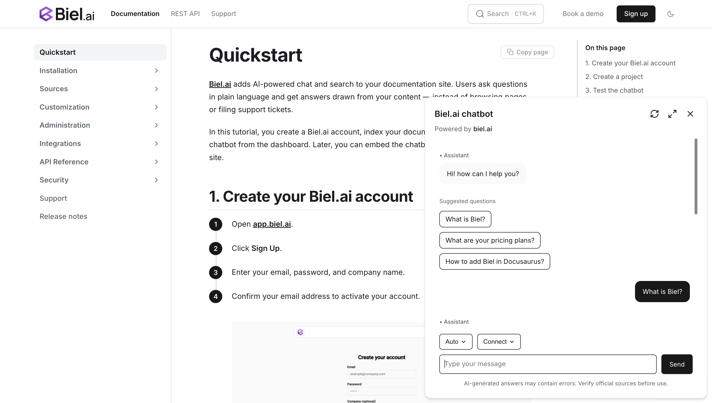

# AI chat widget for Mintlify

Add an AI chatbot to your Mintlify documentation using Biel.ai's web components. The integration works with any Mintlify project and can be added through custom script configuration in your mint.json file.

This guide shows you how to add the chat widget to your Mintlify docs in minutes.

## Prerequisites

Before starting, ensure you have:
- A **Biel.ai account**. If you don't have one, [sign up for free](https://app.biel.ai/accounts/signup/).
- **A project created in your Biel.ai dashboard**. Follow the [Quickstart guide](../quickstart.md) to create one.
- **A Mintlify documentation site** ready to install Biel.ai.

## Installation

The Biel.AI chat widget enables a conversational chat powered by AI in your site.



To integrate the Biel.AI chat widget into your Mintlify site:

1. Open your Mintlify project in your preferred code editor.

2. Locate your `mint.json` configuration file in the root directory of your project.

3. Add the Biel.ai scripts to the `head` section of your `mint.json`:

    ```json
    {
      "name": "Your Docs",
      "head": [
        {
          "tag": "link",
          "attributes": {
            "rel": "stylesheet",
            "href": "https://cdn.jsdelivr.net/npm/biel-search/dist/biel-search/biel-search.css"
          }
        },
        {
          "tag": "script",
          "attributes": {
            "type": "module",
            "src": "https://cdn.jsdelivr.net/npm/biel-search/dist/biel-search/biel-search.esm.js"
          }
        }
      ]
    }
    ```

4. Add a custom script to inject the Biel.ai button. In your `mint.json`, add the following to the `scripts` section:

    ```json
    {
      "scripts": [
        {
          "content": "window.addEventListener('DOMContentLoaded', function() { var button = document.createElement('biel-button'); button.setAttribute('project', '<YOUR_PROJECT_ID>'); button.setAttribute('header-title', 'Biel.ai chatbot'); button.setAttribute('button-position', 'bottom-right'); button.setAttribute('modal-position', 'bottom-right'); button.setAttribute('button-style', 'dark'); button.textContent = 'Ask AI'; document.body.appendChild(button); });"
        }
      ]
    }
    ```

    Replace `<YOUR_PROJECT_ID>` with your project's ID from the [Biel.ai dashboard](../quickstart.md#2-create-a-project).

5. Your complete `mint.json` configuration should look similar to this:

    ```json
    {
      "name": "Your Docs",
      "head": [
        {
          "tag": "link",
          "attributes": {
            "rel": "stylesheet",
            "href": "https://cdn.jsdelivr.net/npm/biel-search/dist/biel-search/biel-search.css"
          }
        },
        {
          "tag": "script",
          "attributes": {
            "type": "module",
            "src": "https://cdn.jsdelivr.net/npm/biel-search/dist/biel-search/biel-search.esm.js"
          }
        }
      ],
      "scripts": [
        {
          "content": "window.addEventListener('DOMContentLoaded', function() { var button = document.createElement('biel-button'); button.setAttribute('project', '<YOUR_PROJECT_ID>'); button.setAttribute('header-title', 'Biel.ai chatbot'); button.setAttribute('button-position', 'bottom-right'); button.setAttribute('modal-position', 'bottom-right'); button.setAttribute('button-style', 'dark'); button.textContent = 'Ask AI'; document.body.appendChild(button); });"
        }
      ]
    }
    ```

6. Save the file and run your Mintlify development server:

    ```console
    mintlify dev
    ```

7. Open your documentation site in a web browser to verify the chatbot appears and works correctly.

## Alternative: Using MDX components

If you prefer more control over where the chatbot appears, you can create a custom MDX component:

1. Create a new file `components/BielChat.mdx` in your Mintlify project:

    ```html
    <biel-button project="<YOUR_PROJECT_ID>" 
        header-title="Biel.ai chatbot"
        button-position="bottom-right"
        modal-position="bottom-right"
        button-style="dark">
            Ask AI
    </biel-button>
    ```

2. Import and use this component in any MDX page where you want the chatbot to appear.

## Next steps

For more about customization and additional features exploration, check out the [customization](/customization) section.

Need assistance? We're here to help! Reach out to us at [Biel.ai Support](https://biel.ai/contact).

