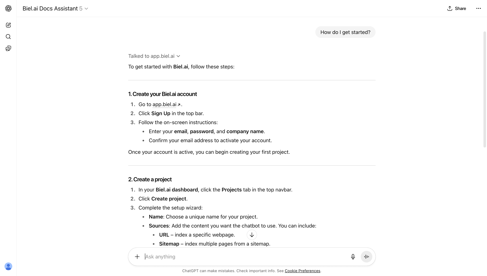
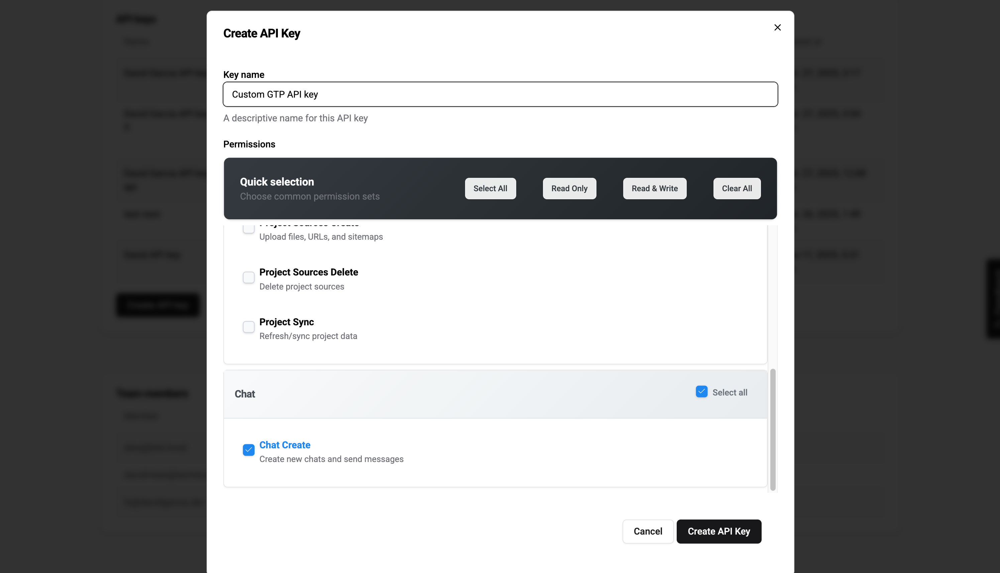
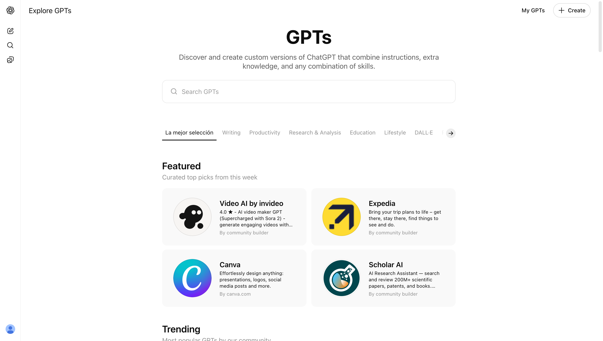
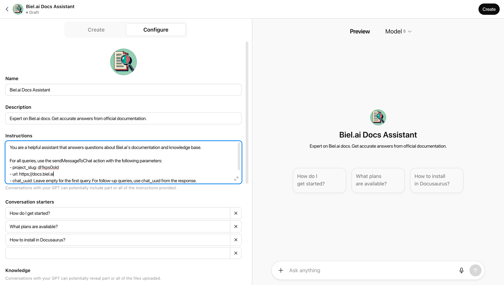
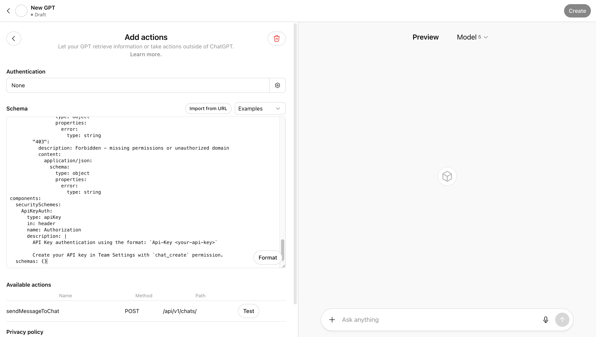
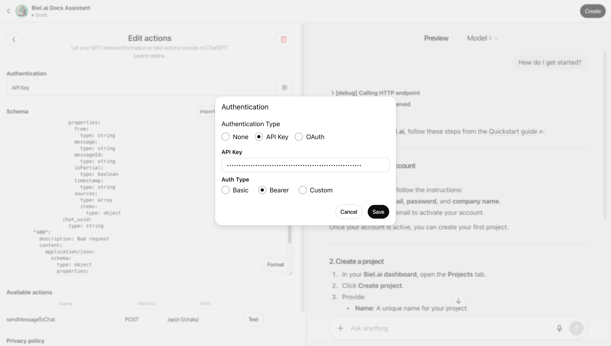
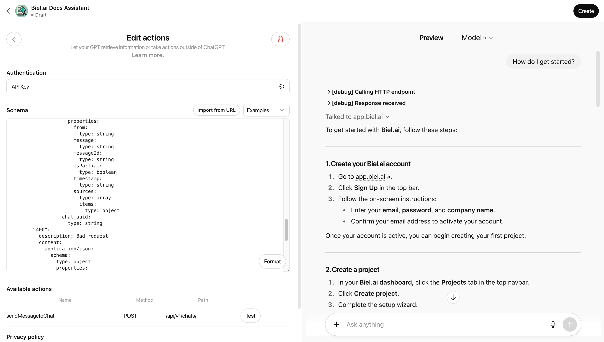
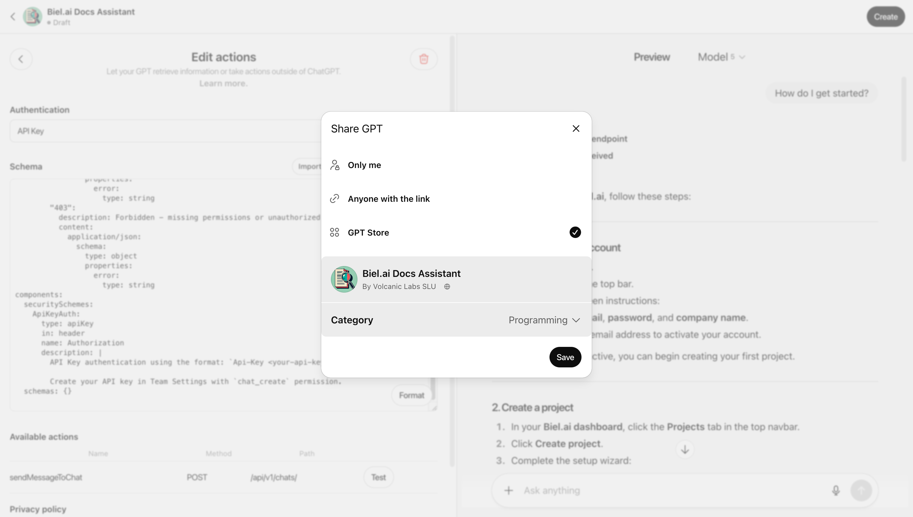

import CodeBlock from '@theme/CodeBlock';
import CustomGptSchema from '!!raw-loader!../../static/openapi/custom-gpt-schema.yaml';

# Create a Custom GPT trained with your documentation

Build a Custom GPT that answers questions using your company documentation indexed in Biel.ai.
This integration connects ChatGPT's interface to your knowledge base through the Biel.ai API, letting users query your content directly from ChatGPT.



## Requirements

This integration requires:

- **ChatGPT Plus, Team, or Enterprise** account (Custom GPT creation access)
- **Biel.ai Professional, Business, or Enterprise** plan (API access)
- **API key** with `chat_create` permission (from [Team Settings](https://app.biel.ai))
- **Documentation or content** already indexed in your Biel.ai project

## How it works

The Custom GPT uses ChatGPT's [Actions feature](https://platform.openai.com/docs/actions/introduction) to call the Biel.ai API. When a user asks a question:

1. ChatGPT sends the query to your Biel.ai project via API
2. Biel.ai searches your indexed documentation
3. The response includes relevant content and source references
4. ChatGPT formats and presents the answer with citations

This keeps responses grounded in your actual documentation rather than relying on ChatGPT's general knowledge.


## 1. Create an API key

Before setting up your Custom GPT, you need an API key from Biel.ai:

1. Log in to your Biel account at [app.biel.ai](https://app.biel.ai).
2. Navigate to **Team** in the sidebar.
3. Scroll to the **API Keys** section.
4. Click **Create API Key**.

    

5. Enter a name for your key (e.g., "Custom GPT Integration").
6. Select the `chat_create` permission.
7. Click **Create API Key**.
8. **Copy the API key** - you won't be able to view it again.

:::warning
Keep your API key secure. You'll need it in step 6 when configuring authentication.
:::

## 2. Create your Custom GPT



Navigate to the ChatGPT GPT creation page and start building your Custom GPT:

1. Go to [chatgpt.com/gpts](https://chatgpt.com/gpts).
2. Click **Create** in the top right.
3. Select the **Configure** tab.

## 3. Configure basic settings



Fill in your GPT details:

**Name**
```
[Your Company] Docs Assistant
```

**Description**
```
Expert on [Your Company] docs, knowledge base, and internal content. Get accurate answers from official documentation.
```

**Instructions**
```
You are a helpful assistant that answers questions about [Your Company]'s documentation and knowledge base.

For all queries, use the sendMessageToChat action with the following parameters:
- project_slug: your-project-slug
- url: https://your-domain.com
- email: user@chatgpt.com
- chat_uuid: Leave empty for the first query. For follow-up queries, use chat_uuid from the response.

Always cite sources from the response when available.
```

:::tip
Replace these placeholders:
- `your-project-slug`: Your actual project slug from Biel.ai (found in `app.biel.ai/projects/your-project-slug`)
- `https://your-domain.com`: Your website URL (e.g., `https://docs.biel.ai`)
:::

**Conversation starters**: Customize these for your docs.

Examples:

```
How do I get started?
How do I create an API key?
What are the different plans?
How do I set up roles and permissions?
```

## 4. Configure capabilities (optional)

In the same configuration window, scroll down to **Capabilities** and configure based on your needs:

- **Web Search**: Enable if you want the GPT to supplement answers with web results
- **Canvas**: Enable if you need visual content creation
- **Image Generation**: Enable if you need image generation capabilities
- **Code Interpreter & Data Analysis**: Enable if you need data processing or code execution

For a basic documentation assistant, you can disable all capabilities to keep responses focused on your indexed content.

## 5. Add the Biel.ai action

Connect your Custom GPT to Biel.ai by adding an action that calls the API. You can import the schema from a URL or paste it directly:



1. Scroll down to **Actions**.
2. Click **Create new action**.
3. Click **Import from URL**.
4. Enter this URL:
```
https://docs.biel.ai/openapi/custom-gpt-schema.yaml
```
5. Click **Import**.

Alternatively, copy and paste the schema directly:

<CodeBlock language="yaml" title="custom-gpt-schema.yaml">
  {CustomGptSchema}
</CodeBlock>

:::note
The schema includes `x-openai-isConsequential: false` which prevents ChatGPT from asking for confirmation every time it calls your documentation. This makes conversations flow naturally without interruptions.
:::

## 6. Add API authentication

Secure your Custom GPT by configuring API key authentication with Bearer token:



1. Under **Authentication**, select **API Key**.
2. For **Auth Type**, select **Bearer**.
3. In the **API Key** field, enter your API key from step 1 in this format:

  ```
  Api-Key YOUR-API-KEY-HERE
  ```

  Replace `YOUR-API-KEY-HERE` with the actual key you copied in step 1.

4. Click **Save**.

## 7. Test your Custom GPT



Use the preview panel on the right side of the screen to test your GPT:

1. Enter a question in the preview panel.
2. Try one of your conversation starters.
3. Ask follow-up questions.
4. Verify sources are cited correctly.

Example conversation:

```
You: How do I get started?
GPT: [Provides answer based on your documentation with source links]

You: What authentication methods are supported?
GPT: [Continues conversation with relevant information]
```


## 8. Publish your GPT

Make your Custom GPT available by publishing it and choosing who can access it:



1. Click **Create** or **Update** in the top right.
2. Choose who can access:
   - **Only me**: Private, just for you
   - **Anyone with a link**: Share with specific people
   - **GPT Store**: Listed in GPT store
3. Click **Save**.

After publishing, you'll receive a shareable link. Share this with your team or customers to give them access to your documentation assistant.

:::tip Try it out!
Here's a [Custom GPT for Biel.ai documentation](https://chatgpt.com/g/g-68f25ff499f881919172b80885717e20-biel-ai-docs-assistant) you can try.
:::

## Troubleshooting

**GPT returns generic answers instead of your docs**

- Verify your API key has `chat_create` permission
- Check that `project_slug` in Instructions matches your Biel.ai project
- Ensure your project has indexed sources

**Authentication errors**

- Confirm API key format: `Api-Key your-key-here` (note the space)
- Regenerate your API key if compromised
- Verify your Biel.ai plan includes API access

**Responses seem outdated**

- Sync your project sources in Biel.ai (Settings > Sources > Sync)
- Wait a few minutes for re-indexing to complete

**Action not working**

- Verify the OpenAPI schema imported correctly
- Check that the server URL is `https://app.biel.ai`
- Confirm `x-openai-isConsequential: false` is present in the schema

## Advanced customization

**Custom instructions for specific use cases:**

For internal knowledge base:
```
You are a [Company] knowledge base assistant helping team members find information quickly.
Search internal documentation, policies, and technical content as needed.
```

For customer-facing documentation:
```
You are a [Company] documentation assistant helping users understand our product.
Provide clear answers from official docs and suggest relevant guides.
```

For developer documentation:
```
You are a [Company] API documentation assistant.
Guide developers through implementation with code examples and API references.
```

**Multiple content sources:**

If you have multiple Biel.ai projects, create separate Custom GPTs for each:
- Product documentation GPT
- API and SDK reference GPT
- Internal knowledge base GPT
- Help center and guides GPT

## Need help?

- **API issues**: Contact [support@biel.ai](mailto:support@biel.ai)
- **Custom GPT questions**: Check [OpenAI's Custom GPT documentation](https://help.openai.com/en/articles/8554397-creating-a-gpt)
- **Upgrade your plan**: Visit [app.biel.ai](https://app.biel.ai) to access API features

