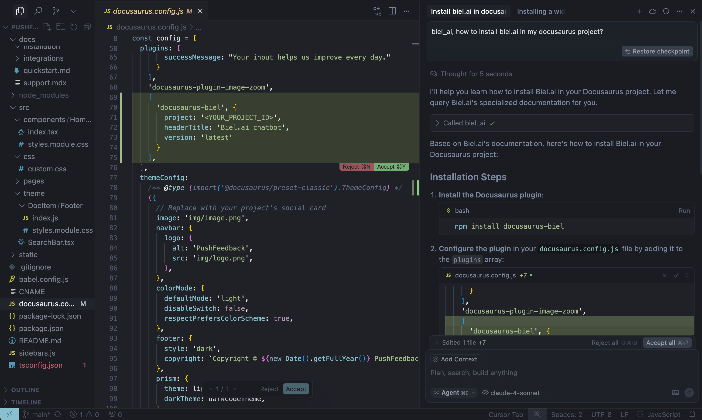

# Docs MCP server

Connect AI coding assistants like Cursor, Claude Desktop, and VS Code to your product documentation using Biel.ai's Model Context Protocol (MCP) server.
Your AI assistant can search and reference your docs while helping developers write code.




The MCP server provides a hosted Retrieval-Augmented Generation (RAG) layer that connects AI tools directly to your indexed documentation.
This enables context-aware code completions, accurate technical answers, and intelligent suggestions based on your actual documentation—all without leaving your IDE.

## How it works

The MCP server acts as a bridge between your AI coding assistant (like Cursor or Claude Desktop) and your Biel.ai project. When your AI needs information about your product or API, it queries your documentation through MCP and receives relevant context to provide better answers.

## Requirements

This integration requires:

- **Biel.ai account** with documentation indexed ([create account](https://app.biel.ai))
- **Project slug** from your Biel.ai dashboard
- **AI coding assistant** that supports MCP:
  - Cursor IDE
  - Claude Desktop
  - VS Code (with MCP extension)
  - Other MCP-compatible tools
- **API key** (optional) - only for private projects on Professional/Business/Enterprise plans

## Setup

Connect your AI coding assistant to Biel.ai using our hosted MCP server (no installation or maintenance required).

Add this configuration to your AI tool's MCP settings:

```json
{
  "mcpServers": {
    "biel-ai": {
      "description": "Query your product's documentation, APIs, and knowledge base.",
      "command": "npx",
      "args": [
        "mcp-remote",
        "https://mcp.biel.ai/sse?project_slug=YOUR_PROJECT_SLUG&domain=https://your-docs-domain.com"
      ]
    }
  }
}
```

Set the following parameters:

- `project_slug:` Your Biel.ai project slug from your dashboard.
- `domain`: Your documentation domain.
- `api_key`: Optional, API key (only needed for private projects)

## Configuration for specific tools

### Cursor IDE MCP setup

1. Open Cursor Settings: `Ctrl+Shift+J` (Windows/Linux) or `Cmd+Shift+J` (Mac).
2. Go to **MCP** → **Add new global MCP Server**
3. Paste the configuration from Step 1
4. Save and restart Cursor.

### Claude Desktop MCP setup

1. Open your MCP configuration file:
   - **macOS**: `~/Library/Application Support/Claude/claude_desktop_config.json`
   - **Windows**: `%APPDATA%\Claude\claude_desktop_config.json`
2. Add the configuration from Step 1.
3. Save and restart Claude Desktop.

### VS Code MCP setup

1. Install the [MCP extension for VS Code](https://marketplace.visualstudio.com/search?term=mcp&target=VSCode).
2. Open VS Code settings → Extensions → MCP configuration.
3. Add the configuration above.
4. Reload VS Code.

## Self-hosted option

For teams who prefer to host their own MCP server, see the [self-hosting documentation](https://github.com/techdocsStudio/biel-mcp) on GitHub.

## Usage

Once configured, your AI coding assistant can query your documentation automatically. Here are three ways to use the integration:

### Automatic queries (recommended)

Your IDE will automatically call the MCP server when needed. The AI reads the `description` field to understand when to use the tool.

**Setup:** Add a clear description to your MCP configuration:

```json
{
  "mcpServers": {
    "biel-ai": {
      "command": "npx",
      "args": [
        "mcp-remote",
        "https://mcp.biel.ai/sse?project_slug=YOUR_PROJECT_SLUG&domain=https://your-docs-domain.com"
      ],
      "description": "Query your product's documentation, APIs, and knowledge base. Ask about API specs, guides, and troubleshooting."
    }
  }
}
```

**Usage:**
```
You: "How do I authenticate users?"
AI: [Automatically queries Biel.ai docs → Returns answer with citations]

You: "What's the rate limiting policy?"
AI: [Sees "API specs" in description → Searches docs → Provides info]
```

### Cursor rules integration

Configure [Cursor rules](https://docs.cursor.com/en/context/rules) to automatically invoke the Biel.ai MCP server for specific query types.

**Create a project rule:**

1. Command Palette: `Cmd+Shift+P` (Mac) or `Ctrl+Shift+P` (Windows/Linux)
2. Select "New Cursor Rule"
3. Name: "biel-ai-auto-query"
4. Content:

```
---
description: Auto-query Biel.ai for documentation and API questions
globs: ["**/*"]
---

For questions about our product documentation, API, or troubleshooting: Use the biel-ai MCP server before responding
```

**File location:** `.cursor/rules/biel-ai-auto-query.mdc`

### Manual trigger with keyword

Add `biel_ai` anywhere in your message to explicitly search your documentation:

**Example conversations:**
```
You: "biel_ai, how do I authenticate users?"
AI: [Searches your Biel.ai docs and provides answer with citations]

You: "What are the rate limits for the API? biel_ai" 
AI: [Returns rate limit info from your documentation]
```

## Configuration options

The MCP server supports several configuration parameters:

- **`project_slug`** (required): Your Biel.ai project identifier
- **`api_key`** (optional): For authentication with private projects
- **`base_url`** (optional): Defaults to `https://app.biel.ai`
- **`domain`** (optional): Your documentation domain for additional context
- **`chat_uuid`** (optional): To continue previous conversations

## Troubleshooting

### Connection issues

If your AI tool can't connect to the MCP server:

1. **Verify project slug:** Make sure it matches your Biel.ai project.
2. **Network connectivity:** Ensure your firewall allows connections to `mcp.biel.ai`
3. **Check project privacy:** For private projects, ensure you have an API key

### No responses

If the AI tool isn't querying Biel.ai:

1. **Include trigger keywords:** Make sure to use `biel_ai` in your messages.
2. **Check project status:** Verify your Biel.ai project has indexed content.
3. **Review logs:** Check your AI tool's logs for MCP-related errors.

### API Key issues

**API keys are only required for private projects** and are available on **Professional**, **Business, and Enterprise plans**.

If you are getting authentication errors:
1. **Check if your project is private:** Public projects don't need API keys.
2. **Upgrade your plan:** API keys require Professional, Business or Enterprise plan.
3. **Regenerate API key:** Create a new API key in your team settings if needed.

## Security considerations

- **API keys are passed per request** and never stored on the MCP server.
- **Restrict API key permissions** to only the necessary Biel.ai projects.
- **Use HTTPS** for all communications (enabled by default with hosted service).

## Next steps

Once you have the MCP integration working:

1. **Explore advanced queries:** Try asking complex questions about your documentation
2. **Customize trigger rules:** Set up custom keywords or patterns for automatic routing.
3. **Monitor usage:** Check your Biel.ai analytics to see how the integration is being used.
4. **Train your team:** Share example queries and best practices with your development team.

For additional configuration options and advanced usage, check out our [API documentation](/api/biel-ai-rest-api-beta).

Need assistance? [Contact us](https://biel.ai/contact) to discuss your specific use case. 