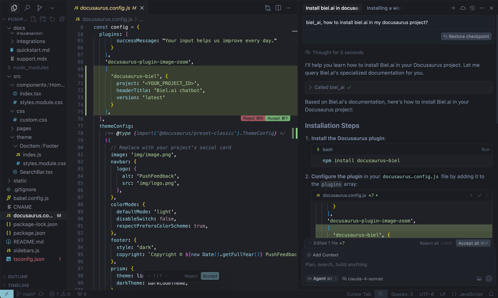

import Tabs from '@theme/Tabs';
import TabItem from '@theme/TabItem';

# Docs MCP server

Connect AI coding assistants like Cursor, Claude Code, and Copilot to your product documentation using Biel.ai's Model Context Protocol (MCP) server.
Your AI assistant can search and reference your docs while helping developers write code.



When your AI needs information about your product or API, it queries your documentation through MCP and receives relevant context to provide better answers without leaving your IDE.

## Requirements

This integration requires:

- **Biel.ai account** with documentation indexed ([create account](https://app.biel.ai))
- **Project slug** from your Biel.ai dashboard
- **AI coding assistant** that supports MCP:
  - Cursor IDE
  - Claude Code
  - VS Code (Copilot)
  - Other MCP-compatible tools
- **API key** (optional) — only for private projects on Business/Enterprise plans

## Setup

Connect your AI coding assistant to Biel.ai using our hosted MCP server (no installation or maintenance required).

**One-click configuration:**

1. Go to your **Biel.ai Widget**.
2. Click on the **Connect** button.
3. Choose your preferred option:
   - **MCP server URL**: Copies the HTTP URL for manual configuration.
   - **Claude Code**: Copies the installation command to your clipboard.
   - **Copilot (VS Code)**: Automatically opens VS Code and adds the MCP server.
   - **Cursor**: Automatically opens Cursor and adds the MCP server.

**Manual configuration:**

<Tabs>
  <TabItem value="http" label="Streamable HTTP (Recommended)" default>

```json
{
  "mcpServers": {
    "biel-ai": {
      "name": "Biel.ai",
      "type": "http",
      "url": "https://mcp.biel.ai/v2/YOUR_PROJECT_SLUG/mcp"
    }
  }
}
```

This is the most reliable and fastest connection method.

  </TabItem>
  <TabItem value="sse" label="Legacy SSE (Deprecated)">

```json
{
  "mcpServers": {
    "biel-ai": {
      "description": "Query your product's documentation, APIs, and knowledge base.",
      "command": "npx",
      "args": [
        "mcp-remote",
        "https://mcp.biel.ai/sse?project_slug=YOUR_PROJECT_SLUG"
      ]
    }
  }
}
```

Use this if your client doesn't support the Streamable HTTP protocol.

  </TabItem>
</Tabs>

For IDE-specific setup instructions, refer to the official documentation:

- [Cursor MCP setup](https://cursor.com/es/docs/context/mcp)
- [VS Code / Copilot MCP setup](https://code.visualstudio.com/docs/copilot/customization/mcp-servers)
- [Claude Code MCP setup](https://code.claude.com/docs/en/mcp)

## Usage

### Automatic tool routing

Once configured, your IDE will automatically call the MCP server when it determines the query is relevant to your documentation. No additional setup is needed.

You can also add `biel_ai` anywhere in your message to explicitly trigger a search:

```
You: "biel_ai, how do I authenticate users?"
AI: [Searches your Biel.ai docs and provides answer with citations]
```

### Custom instructions

For more control, you can add project-level instructions that tell your AI assistant to always check your documentation before responding.

Create a rule file with the following content and save it in your project:

```
For questions about our product documentation, API, or troubleshooting:
Use the biel-ai MCP server before responding.
```

Where to add instructions in each tool:

| Tool | File location | Documentation |
|------|--------------|---------------|
| Cursor | `.cursor/rules/*.mdc` | [Cursor rules](https://docs.cursor.com/en/context/rules) |
| Claude Code | `.claude/CLAUDE.md` | [Claude Code instructions](https://docs.anthropic.com/en/docs/claude-code/memory) |
| Copilot (VS Code) | `.github/copilot-instructions.md` | [Copilot instructions](https://code.visualstudio.com/docs/copilot/customization/instructions) |

## Configuration parameters

You can append query parameters to the MCP URL to customize the connection:

| Parameter | Required | Description |
|-----------|----------|-------------|
| `project_slug` | Yes | Your Biel.ai project identifier from your dashboard. |
| `api_key` | No | API key for private projects (Business/Enterprise plans). If you've already set the `api-key` attribute on your [`<biel-button>` or `<biel-search-button>`](/customization/layout), the widget handles authentication automatically and you don't need to pass it here. |
| `domain` | No | Domain URL to pass as context. Required only if "Allowed domains" is enabled in project settings. |
| `metadata` | No | Tag to identify the conversation source (e.g., `cursor`). |
| `base_url` | No | Override the default API base URL. Defaults to `https://app.biel.ai`. |
| `chat_uuid` | No | UUID to continue a previous conversation. |

**Example URL with parameters:**

`https://mcp.biel.ai/v2/YOUR_PROJECT_SLUG/mcp?api_key=sk_...&domain=docs.example.com`

## Widget customization

You can control how the MCP integration appears in your Biel.ai widget using the following properties:

### Hide connect button

Use the `hide-connect-button` property to hide the Connect button from the widget header. This is useful when you want MCP to be enabled for your project, but don't want to show the connection options to your users:

**biel-button example:**
```html
<biel-button
  project="YOUR_PROJECT_ID"
  hide-connect-button="true"
>
  Ask AI
</biel-button>
```

**biel-search-button example:**
```html
<biel-search-button
  project="YOUR_PROJECT_ID"
  hide-connect-button="true"
>
  Search
</biel-search-button>
```

**Priority:** When `hide-connect-button` is set to `true`, the **Connect** button will be hidden regardless of whether MCP is enabled in your project settings.

### Custom MCP server URL

Use the `mcp-server-url` property to manually specify a custom MCP server URL. This is useful when:
- Your MCP server requires authentication (e.g., API keys)
- You're running a custom or self-hosted MCP server
- You need to override the default MCP server provided by the API

**biel-button example:**
```html
<biel-button
  project="YOUR_PROJECT_ID"
  mcp-server-url="https://mcp.biel.ai/v2/YOUR_PROJECT/mcp?api_key=sk_..."
>
  Ask AI
</biel-button>
```

**biel-search-button example:**
```html
<biel-search-button
  project="YOUR_PROJECT_ID"
  mcp-server-url="https://custom-mcp-server.example.com/mcp"
>
  Search
</biel-search-button>
```

**Priority:** When `mcp-server-url` is specified, it takes priority over the MCP URL provided by the API response.

**Use cases:**
- **API Key Authentication**: Add your API key directly to the URL for private projects
- **Custom MCP Servers**: Point to your own self-hosted or custom MCP implementation
- **Testing**: Override the production MCP URL with a staging or development server

For more details on available widget properties, see [Widget Customization](/customization/layout).

## Self-hosted option

For teams who prefer to host their own MCP server, see the [self-hosting documentation](https://github.com/techdocsStudio/biel-mcp) on GitHub.

## Troubleshooting

### Connection issues

If your AI tool can't connect to the MCP server:

1. **Verify project slug:** Make sure it matches your Biel.ai project.
2. **Network connectivity:** Ensure your firewall allows connections to `mcp.biel.ai`.
3. **Check project privacy:** For private projects, ensure you have an API key.

### No responses

If the AI tool isn't querying Biel.ai:

1. **Include trigger keywords:** Make sure to use `biel_ai` in your messages.
2. **Check project status:** Verify your Biel.ai project has indexed content.
3. **Review logs:** Check your AI tool's logs for MCP-related errors.

### API key issues

**API keys are only required for private projects** and are available on **Business** and **Enterprise** plans.

If you are getting authentication errors:

1. **Check if your project is private:** Public projects don't need API keys.
2. **Upgrade your plan:** API keys require Business or Enterprise plan.
3. **Regenerate API key:** Create a new API key in your team settings if needed.

For additional configuration options and advanced usage, check out our [API documentation](/api/biel-ai-rest-api-beta).
