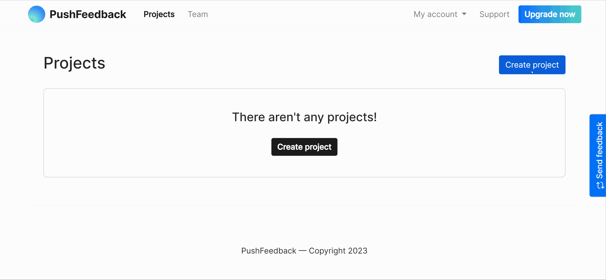

# Quickstart

Welcome to the Biel.ai documentation! In a few minutes, you'll have a chatbot up and running on your site.

## 1. Create your Biel.ai account

To use the Biel.ai widget, start by setting up your account:

1. Open [app.biel.ai](https://app.biel.ai).
2. Click on the **Sign Up** button located in the top bar.
3. Follow the on-screen instructions to set up your account.

    

With your account ready, move on to creating your first project.

## 2. Create a project

Follow these steps to initiate a new project:

1. In your Biel.ai dashboard, click the **Projects** tab in the top navbar.
2. Click the **Create project** button.
3. Step through the wizard, providing details about your project as prompted:

    

    * **Name:** A unique name for your project.
    * **Sources:** The platforms where you plan to use the Biel.ai widget.

4. Click **Save**.

## 3. Add the widget to your site

To integrate the Biel.ai widget into your website:

1. Insert the following code within the `<head>` section of your site's HTML:

    ```html
    <!-- Initialize the Biel.ai widget -->
    <link rel="stylesheet" href="https://cdn.jsdelivr.net/npm/biel-search/dist/biel-search/biel-search.css">
    <script type="module" src="https://cdn.jsdelivr.net/npm/biel-search/dist/biel-search/biel-search.esm.js"></script>
    ```

    :::info
    The above method is the standard way of integrating the widget into an static HTML site. If you're using a particular web framework or content management system, Biel.ai offers tailored installation options and plugins. For a comprehensive guides, refer to our [Installation](/category/installation) documentation.
    :::

1. Just before the closing `</body>` tag of your website's HTML, add the following snippet:

    ```html
    <biel-button project="<YOUR_PROJECT_ID>" button-position="bottom-right" modal-position="bottom-right" button-style="dark">ASK AI</biel-button>
    ```

Replace `<YOUR_PROJECT_ID>` with your project's ID you obtained from the previous step.

## 4. Customize the widget

Get the Biel.ai widget to blend with your website's design and functionality. Here's a quick look at some customization options:

* **Initial message:** Set the widget's opening message to greet users or provide context.

* **Suggested questions:** Predefine questions to guide users on what to ask.

* **Position:** Choose the widget's placement on your site—bottom right, top left, or even integrate it with an existing button.

* **Look and feel:** Modify colors, fonts, and more to ensure the widget harmonizes with your site's aesthetics.

* **Text:** Adapt the widget's text to mirror your site's tone or language.

For detailed configuration steps, see our [Configuration](/category/configuration) documentation.

## Next steps

Congratulations on setting up the Biel.ai widget! Now, your users can interact with your site more effectively.

Monitor your [dashboard](https://apps.biel-search.com) to gain insights from user interactions and improve your documentation accordingly.
