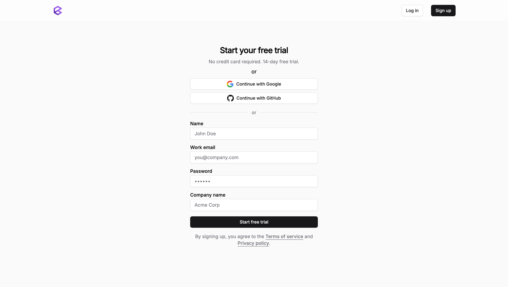
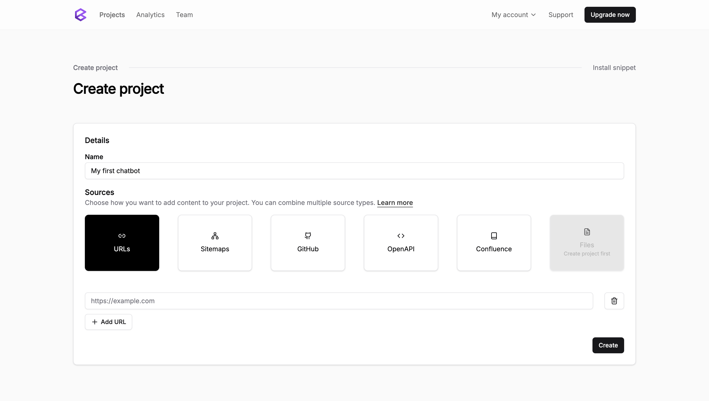
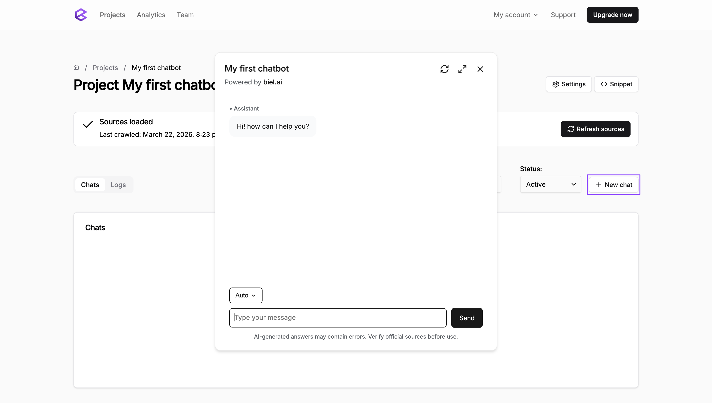

# Quickstart

[Biel.ai](https://biel.ai) adds AI-powered chat and search to your documentation site. Users ask questions in plain language and get answers drawn from your content — instead of browsing pages or filing support tickets.

In this tutorial, you create a Biel.ai account, index your documentation, and test the chatbot from the dashboard. Later, you can embed the chatbot or search widget on your site.

## 1. Create your Biel.ai account

1. Open [app.biel.ai](https://app.biel.ai).
2. Click **Sign Up**.
3. Enter your email, password, and company name.
4. Confirm your email address to activate your account.

    

## 2. Create a project

A project groups your content sources and powers the chatbot. Each project has its own index, settings, and analytics.

1. In the dashboard, click **Projects** > **Create project**.
2. Enter a **Name** for your project.
3. Add one or more **Sources** to index:

    | Source type | Description |
    |---|---|
    | **URL** | A single webpage. |
    | **Sitemap** | Multiple pages from a sitemap URL. |
    | **GitHub repository** | README files and docs folders from a repo. |
    | **Files** | PDFs, Word documents, and other uploaded files. |

    

4. Click **Create**, then click **Done**.

Biel.ai begins crawling your sources. Wait a few minutes, then refresh the page to check the indexing status.

## 3. Test the chatbot

Now that your content is indexed, verify that the chatbot returns accurate answers:

1. In the project dashboard, click **New chat**.
2. Type a question and click **Send**.

    

:::tip[Not getting good answers?]
- Check **Logs** to verify that your sources were indexed correctly.
- Adjust the chatbot behavior in **Settings**.
- Click **Refresh sources** to re-crawl your content.
:::

## Next steps

Your project is ready. Choose how you want to surface it to users:

- **Chatbot widget** — Embed an AI chat button on your site. See the [Installation](/installation) guides for your platform.
- **Search widget** — Add an AI-powered search bar instead of (or alongside) the chatbot. See [Install biel-search](/installation/cdn#advanced-install-biel-search).
- **MCP server** — Let developers query your docs from AI coding assistants like Claude or Cursor. See [MCP Server](/integrations/mcp-server).
- **Integrations** — Connect Biel.ai to GitHub Actions, Custom GPTs, Zapier, and more. See [Integrations](/integrations).
