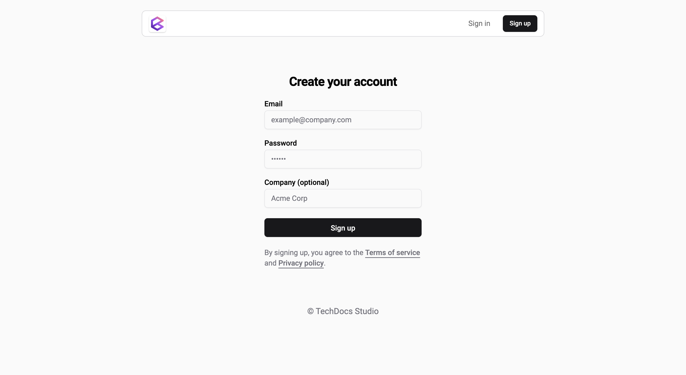

# Quickstart

Welcome to the **Biel.ai** documentation! In just a few steps, you'll have a chatbot integrated and running on your website.

## 1. Create your Biel.ai account

To install the Biel.ai chatbot, start by setting up your account:

1. Open [app.biel.ai](https://app.biel.ai).
2. Click **Sign Up** in the top bar.
3. Follow the on-screen instructions to complete your account setup:

    

Once your account is ready, you can begin creating your first project.

## 2. Create a project

Follow these steps to create and configure a new project:

1. In your Biel.ai dashboard, click the **Projects** tab in the top navbar.
2. Click **Create project**.
3. Complete the project setup wizard by providing the necessary details:

    

    * **Name**: A unique identifier for your project.
    * **Sources**: Add the sources you want to index for your project:
        * **URL**: Index a specific webpage.
        * **Sitemap**: Index multiple pages from a sitemap, useful for indexing entire websites.
        * **Files**: Index documents such as PDFs, Word files, and more.

4. Click **Save** to finalize your project setup.

## 3. Add the widget to your site

To embed the Biel.ai widget on your website, follow these integration steps:

1. Add the following code within the `<head>` section of your site's HTML:

    ```html
    <!-- Initialize the Biel.ai widget -->
    <link rel="stylesheet" href="https://cdn.jsdelivr.net/npm/biel-search/dist/biel-search/biel-search.css">
    <script type="module" src="https://cdn.jsdelivr.net/npm/biel-search/dist/biel-search/biel-search.esm.js"></script>
    ```

    :::info
    The above method is for static HTML sites. For specific platforms (e.g., WordPress, React, etc.), Biel.ai offers tailored plugins and installation guides. Check the [Installation](/category/installation) documentation for more details.
    :::

2. Just before the closing `</body>` tag of your website's HTML, insert this code snippet:

    ```html
    <biel-button project="<YOUR_PROJECT_ID>" 
        header-title="Biel.ai chatbot"
        button-position="bottom-right"
        modal-position="bottom-right"
        button-style="dark">
            Ask AI
    </biel-button>
    ```

    Replace `<YOUR_PROJECT_ID>` with the unique project ID you received after setting up your project.

3. You should see the widget installed in your site:

    

## 4. Customize the widget

Make the Biel.ai widget match your website’s style and user experience. You can customize:

* **Initial message**: Set a welcome message to greet users or provide instructions.
* **Suggested questions**: Predefine questions to guide users on what to ask.
* **Position**: Select where the widget appears—bottom right, top left, or integrated into an existing button.
* **Appearance**: Modify colors, fonts, and other visual elements to align with your website’s branding.
* **Text**: Adjust the widget's text to fit your website's tone and language.

For advanced customization options, refer to [Customization](/category/customization).

## Next steps

Congratulations! Your Biel.ai widget is now live on your website, allowing users to interact with your content in new ways.

Don't forget to monitor your [dashboard](https://app.biel.ai) for user insights and feedback, which can help you optimize your chatbot's performance.
