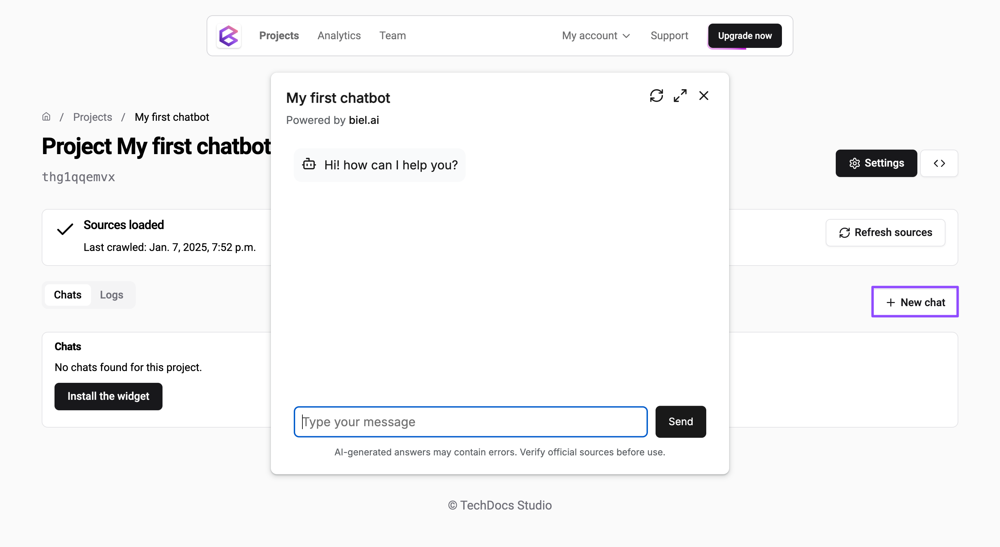

# Quickstart

**Biel.ai** transforms your static documentation into an intelligent, 24/7 AI assistant that provides instant, accurate answers to user questions. Instead of users digging through pages of docs, they simply ask questions and get immediate help—reducing your support workload while improving user experience.

Ready to get started? In just a few minutes, you'll have an AI-powered chatbot running on your website and answering questions from your documentation.

## 1. Create your Biel.ai account

To install the Biel.ai chatbot, start by setting up your account:

1. Open [app.biel.ai](https://app.biel.ai).
2. Click **Sign Up** in the top bar.
3. Follow the on-screen instructions to complete your account setup:

    

    - Provide your email, and password, and company name.
    - Confirm your email address to activate your account.

Once your account is ready, you can begin creating your first project.

## 2. Create a project

Follow these steps to create and configure a new project:

1. In your Biel.ai dashboard, click the **Projects** tab in the top navbar.
2. Click **Create project**.
3. Complete the project setup wizard by providing the necessary details:

    

    * **Name**: A unique identifier for your project.
    * **Sources**: Add the sources you want to index for your project:
        * **URL**: Index a specific webpage.
        * **Sitemap**: Index multiple pages from a sitemap, useful for indexing entire websites.
        * **GitHub repositories**: Index documentation from code repositories, including README files and docs folders.
        * **Files**: Index documents such as PDFs, Word files, and more.

4. Click **Create** and **Done!** to finalize your project setup.

Biel.ai will start crawling your documents. Please allow a few minutes for the process to complete, or refresh the page to check the status.

## 3. Chat with your docs

Once your project is created and the documents are indexed, your chatbot will be ready to interact with the content.

To test your chatbot:

1. Click **New chat** in the **Project** dashboard.
2. Enter a query or ask a question to see how your chatbot responds:

    

3. Click **Send**.

:::tip
If the chatbot does not provide accurate or helpful responses, try the following steps:

1. Review the sources loaded in the **Logs** section to ensure the necessary content is indexed correctly.
2. Adjust advanced settings in **Settings** to fine-tune the chatbot's behavior and improve responses.
3. Click **Refresh sources** to re-crawl the indexed content.
:::

## Next steps

Congratulations! You've successfully created your first chatbot.

To integrate the chatbot widget into your website, check out the [Installation](/installation) guides. You'll find detailed instructions for embedding the chatbot in your site, customizing its appearance, and configuring advanced integration options.
